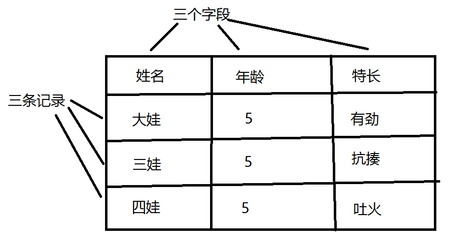
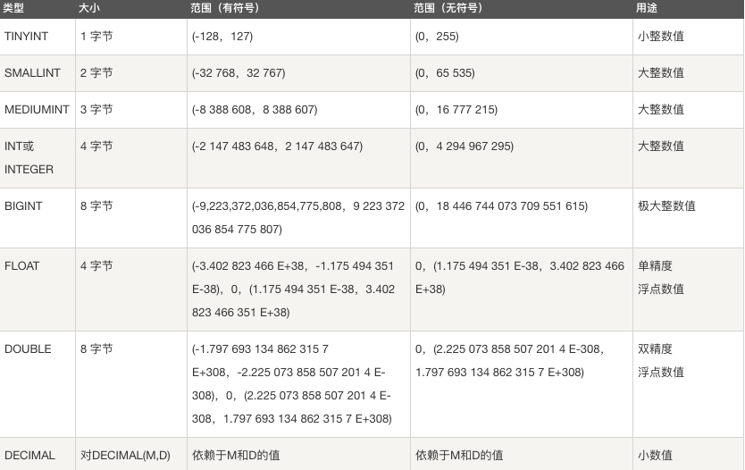
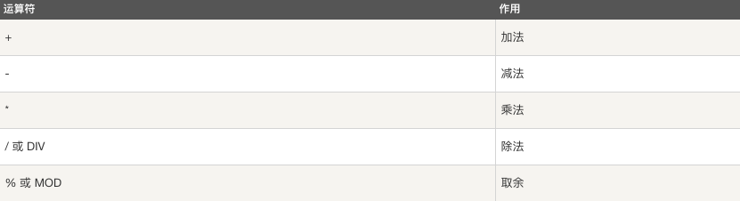
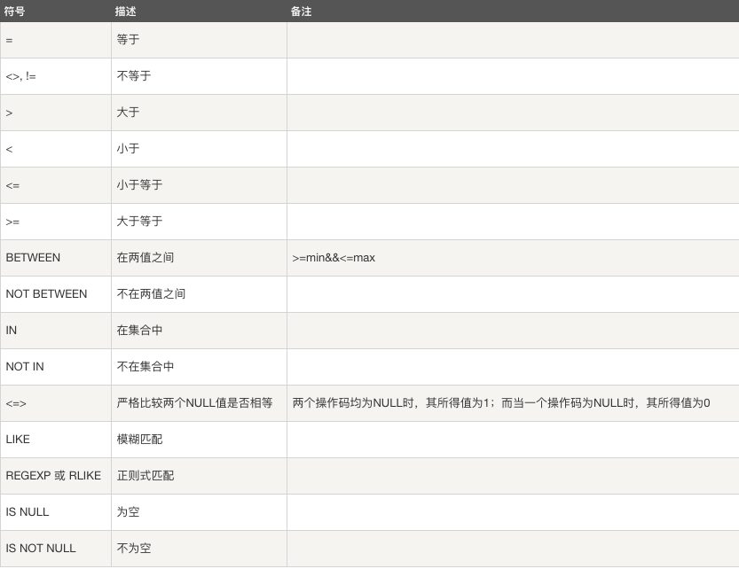
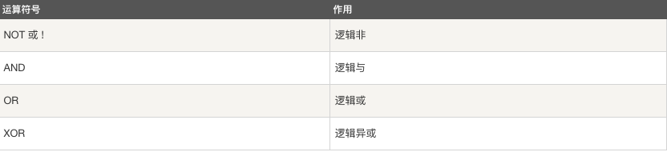
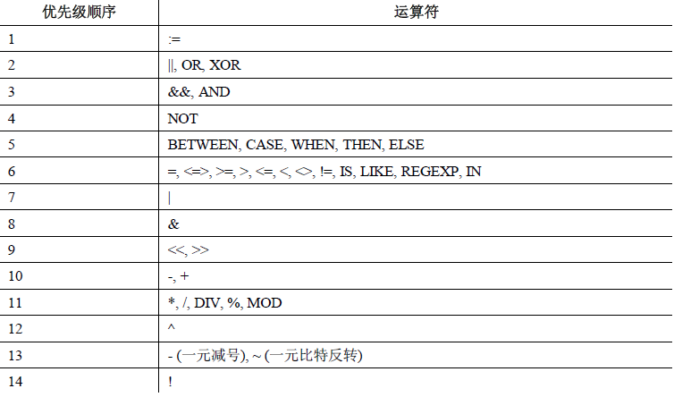

## 一、数据库概述

### 1.数据存储阶段 

【1】 人工管理阶段

缺点 ：  数据无法共享,不能单独保持,数据存储量有限

【2】 文件管理阶段 （.txt  .doc  .xls）
    
优点 ： 数据可以长期保存,可以存储大量的数据,使用简单

缺点 ：  数据一致性差,数据查找修改不方便,数据冗余度可能比较大

【3】数据库管理阶段

优点 ： 数据组织结构化降低了冗余度,提高了增删改查的效率,容易扩展,方便程序调用，做自动化处理

缺点 ：需要使用sql 或者 其他特定的语句，相对比较复杂


### 2.基础概念

>数据 ： 能够输入到计算机中并被识别处理的信息集合

>数据结构 ：研究一个数据集合中数据之间关系的

>数据库 ： 按照数据结构，存储管理数据的仓库。数据库是在数据库管理系统管理和控制下，在一定介质上的数据集合。 并发问题

>数据库管理系统 ：管理数据库的软件，用于建立和维护数据库

>数据库系统 ： 由数据库和数据库管理系统，开发工具等组成的集合 
>
>数据仓库：数据量更加庞大，更加侧重数据分析和数据挖掘，供企业决策分析之用，主要是数据查询，修改和删除很少  磁盘和数据格式问题
>


### 3.数据库分类和常见数据库

* 关系型数据库和非关系型数据库    
>关系型： 采用关系模型（二维表）来组织数据结构的数据库 

>非关系型： 不采用关系模型组织数据结构的数据库

* 开源数据库和非开源数据库

> 开源：MySQL、SQLite、MongoDB

> 非开源：Oracle、DB2、SQL_Server

* 常见的关系型数据库
  
> MySQL、Oracle、SQL_Server、DB2 SQLite  


### 4.认识关系型数据库和MySQL

(1) 数据库结构 （图库结构）

>数据元素 --> 记录 -->数据表 --> 数据库


(2) 数据库概念解析

>数据表 ： 存放数据的表格 

>字段： 每个列，用来表示该列数据的含义

>记录： 每个行，表示一组完整的数据



(3) MySQL特点

* 是开源数据库，使用C和C++编写 
* 能够工作在众多不同的平台上
* 提供了用于C、C++、Python、Java、Perl、PHP、Ruby众多语言的API
* 存储结构优良，运行速度快
* 功能全面丰富
* 基于**磁盘存储**，数据是以**文件形式**存放在数据库目录/var/lib/mysql下

(4) MySQL安装

>Ubuntu安装MySQL服务
>>安装服务端: sudo apt-get install mysql-server  
>>安装客户端: sudo apt-get install mysql-client
>>
>>> 配置文件：/etc/mysql  
>>> 命令集： /usr/bin  
>>> 数据库存储目录 ：/var/lib/mysql

>Windows安装MySQL
>>下载MySQL安装包(windows)  https://dev.mysql.com/downloads/mysql/
>>[下载MySQL安装包(windows)]( https://dev.mysql.com/downloads/mysql/)  
  mysql-installer***5.7.***.msi
>>安装教程去安装

5. 启动和连接MySQL服务

>服务端启动
>>查看MySQL状态: sudo /etc/init.d/mysql status  
>>启动服务：sudo /etc/init.d/mysql start | stop | restart

>客户端连接
>>命令格式 
>>>mysql -h主机地址 -u用户名 -p密码
>>>mysql -hlocalhost -uroot -p123456(mysql -u root -p)  
>>>本地连接可省略 -h 选项: mysql -uroot -p123456

>关闭连接
>> ctrl-D
>> exit


## 二、SQL语句
> 什么是SQL
>
> >结构化查询语言(Structured Query Language)，一种特殊目的的编程语言，是一种数据库查询和程序设计语言，用于存取数据以及查询、更新和管理关系数据库系统。

> SQL语句使用特点
>* SQL语言基本上独立于数据库本身
>* 各种不同的数据库对SQL语言的支持与标准存在着细微的不同
>* 每条命令必须以** ;** 结尾
>* SQL命令关键字不区分字母大小写

## 三、MySQL 数据库操作

### 1.数据库操作

```mysql
    1、查看已有库；
   		show databases;
    2、创建库并指定字符集；
		create database 库名 charset utf8;
		create database 库名 character set utf8;
    3、查看当前所在库；
      	select database();
    4、切换库；
      	use 库名
    5、查看库中已有表；
      	show tables;
    6、删除库；
      	drop database 库名；
```

注：库名的命名规则
>* 数字、字母、下划线,但不能使用纯数字
>* 库名区分字母大小写
>* 不能使用特殊字符和mysql关键字


### 2.数据表的管理

#### (1) 表结构设计初步

    【1】 分析存储内容  
    【2】 确定字段构成  
    【3】 设计字段类型  

#### (2) 表管理

```mysql
    1、创建表并指定字符集；
      create table 表名(字段名 字段类型 xxx)charset=utf8;
      * 创建表(指定字符集)
>>create table 表名(
	字段名 数据类型,
	字段名 数据类型,
	...
	字段名 数据类型
	);
>>* 如果你想设置数字为无符号则加上 unsigned
>>* 如果你不想字段为 NULL 可以设置字段的属性为 NOT NULL， 在操作数据库时如果输入该字段的数据为NULL ，就会报错。
>>* DEFAULT 表示设置一个字段的默认值
>>* AUTO_INCREMENT定义列为自增的属性，一般用于主键，数值会自动加1。
>>* PRIMARY KEY关键字用于定义列为主键。主键的值不能重复。

```sql
e.g.  创建班级表
create table class_1 (id int primary key auto_increment,name varchar(32) not null,age int unsigned not null,sex enum('w','m'),score float default 0.0);

e.g. 创建兴趣班表
create table interest (id int primary key auto_increment,name varchar(32) not null,hobby set('sing','dance','draw'),level char not null,price decimal(6,2),comment text);
    2、查看创建表的语句 (字符集、存储引擎)；	show create table 表名;
      
    3、查看表结构;
      desc 表名；     
      
    4、删除表;   
      drop table 表名1，表名2
```

####  (3) 表记录管理

```mysql
    1、增 ： insert into 表名(字段名) values(),()
    2、删 ： delete from 表名 where 条件 主要数据不要删，可以使用字段进行标记
       注意:delete语句后如果不加where条件,所有记录全部清空
    3、改 ： update 表名 set 字段名=值 where 条件 
    4、查 ： select 字段名/* from 表名 where 条件
```

#### (4) 表字段管理（alter table 表名）

```mysql
    1、增 ： alter table 表名 add 字段名 字段类型 first|after 字段名 
    2、删 ： alter table 表名 drop 字段名;
    3、改 ： alter table 表名 modify 字段名 字段类型 
    4、表重命名：
    	alter table 表名 rename 新表名
```

### 3.数据高级操作                                              

#### (1)模糊比较

```sql
> 模糊查询和正则查询

>>LIKE用于在where子句中进行模糊查询，SQL LIKE 子句中使用百分号 %来表示任意0个或多个字符，下划线 _ 表示任意一个字符。

>>使用 LIKE 子句从数据表中读取数据的通用语法：

```sql
SELECT field1, field2,...fieldN 
FROM table_name
WHERE field1 LIKE condition1
```

```sql
e.g. 
mysql> select * from class_1 where name like 'A%';
```

>>mysql中对正则表达式的支持有限，只支持部分正则元字符

```sql
SELECT field1, field2,...fieldN 
FROM table_name
WHERE field1 REGEXP condition1
```

```sql
e.g. 
select * from class_1 where name regexp '^B.+';
```

#### (2) 联合查询

>>UNION 操作符用于连接两个以上的 SELECT 语句的结果组合到一个结果集合中。多个 SELECT 语句会删除重复的数据。

>>UNION 操作符语法格式：

```sql
SELECT expression1, expression2, ... expression_n
FROM tables
[WHERE conditions]
UNION [ALL | DISTINCT]
SELECT expression1, expression2, ... expression_n
FROM tables
[WHERE conditions];
```
>expression1, expression2, ... expression_n: 要检索的列。
>tables: 要检索的数据表。
>WHERE conditions: 可选， 检索条件。
>DISTINCT: 可选，删除结果集中重复的数据。默认情况下 UNION 操作符已经删除了重复数据，所以 DISTINCT 修饰符对结果没啥影响。
>ALL: 可选，返回所有结果集，包含重复数据。

```sql
select * from class_1 where sex='m' UNION ALL select * from class_1 where age > 9;
```

#### (3) 逻辑比较

```mysql
and  or      gender - > 性别
eg1 : 查询成绩不及格的男生
  select * from students where score <60 and gender='male';
eg2 : 查询成绩在60-70之间的学生
  select * from students where score >=60 and score <= 70;
```

#### (4) 范围内比较

```mysql
between 值1 and 值2 、in() 、not in()
eg1 : 查询不及格的学生姓名及成绩
  	select name, score from students where score between 0 and 59;
eg2 : 查询AID19和AID18班的学生姓名及成绩
  	select name,score from students where class  in('AID19', 'AID18');
```

#### (5) NULL判断

```mysql
is NULL 、is not NULL
eg1 : 查询姓名字段值为NULL的学生信息
  select * from students where name is NULL;
```

#### (6) 排序

>>ORDER BY 子句来设定你想按哪个字段哪种方式来进行排序，再返回搜索结果。

>>使用 ORDER BY 子句将查询数据排序后再返回数据：

```sql
SELECT field1, field2,...fieldN from table_name1 where field1
ORDER BY field1 [ASC [DESC]]
```

>>默认情况ASC表示升序，DESC表示降序

```sql
select * from class_1 where sex='m' order by age;
```

#### (7) 分页

LIMIT 子句用于限制由 SELECT 语句返回的数据数量 或者 UPDATE,DELETE语句的操作数量

>>带有 LIMIT 子句的 SELECT 语句的基本语法如下：

```sql
limit n ：显示前n条
limit m,n ：从第(m+1)条记录开始，显示n条
分页：每页显示10条，显示第6页的内容
     limit (6-1)*10, 10
     
     每页显示 a 条， 显示第b页的内容
     limit (b-1)*a, a
     
SELECT column1, column2, columnN 
FROM table_name
WHERE field
LIMIT [num]
```

#### (8) 聚合函数

| 方法          | 功能                 |
| ------------- | -------------------- |
| avg(字段名)   | 该字段的平均值       |
| max(字段名)   | 该字段的最大值       |
| min(字段名)   | 该字段的最小值       |
| sum(字段名)   | 该字段所有记录的和   |
| count(字段名) | 统计该字段记录的个数 |
|               |                      |

eg1 : 找出表中的最大攻击力的值？

```mysql
 select max(attack) from sanguo;
```

eg2 : 表中共有多少个英雄？

```mysql
 select count(name) a from sanguo;
```

eg3 : 蜀国英雄中攻击值大于200的英雄的数量

```mysql
select count(id) from sanguo where country='蜀国' and attack > 200;
```

- **group by**

给查询的结果进行分组
eg1 : 计算每个国家的平均攻击力

```mysql
select country , avg(attack) from sanguo group by country;
```


eg2 : 所有国家的男英雄中 英雄数量最多的前2名的 国家名称及英雄数量

```mysql
select country, count(id) as number from sanguo where gender='M' group by country
order by number DESC
limit 2
```

​	==group by后字段名必须要为select后的字段==
​	==查询字段和group by后字段不一致,则必须对该字段进行聚合处理(聚合函数)==

- **having语句**

对分组聚合后的结果进行进一步筛选

```mysql
eg1 : 找出平均攻击力大于105 having avg(attack)>105 的国家的前2名,显示国家名称和平均攻击力
select country ,avg(attack) from sanguo group by country having avg(attack)>105 order by avg(attack) DESC limit 2;

```

注意

```mysql
having语句通常与group by联合使用
having语句存在弥补了where关键字不能与聚合函数联合使用的不足,where只能操作表中实际存在的字段,having操作的是聚合函数生成的显示列
```

- **distinct语句**

不显示字段重复值  排重

```mysql
eg1 : 表中都有哪些国家
  		select distinct country, name from sanguo;
eg2 : 计算一共有多少个国家
  		select count(distinct country) from sanguo;
```


注意

```mysql
distinct和from之间所有字段都相同才会去重
distinct不能对任何字段做聚合处理
```

#### (9) 查询表记录时做数学运算

运算符 ： +  -  *  /  %  **

```mysql
eg1: 查询时显示攻击力翻倍
  	 select name, attack*2 from sanguo
eg2: 更新蜀国所有英雄攻击力 * 2
	update sanguo set attack=attck*2 where country='蜀国';
```

```
次序
3、select ...聚合函数 from 表名
1、where ...
2、group by ...
4、having ...
5、order by ...
6、limit ...;
```

#### (10）SQL命令运行时间监测

​		mysql>show variables like '%pro%';

​		1、开启 ：mysql> set profiling=1;
​		2、查看 ：mysql> show profiles;
​		3、关闭 ：mysql> set profiling=0;

#### (11）高级查询

##### 嵌套查询(子查询)

定义

把内层的查询结果作为外层的查询条件

语法格式

```mysql
select ... from 表名 where 条件(select ....);
```

示例

```mysql
1、把攻击值小于平均攻击值的英雄名字和攻击值显示出来
  select name, attack from sanguo where attack < (select avg(attack) from sanguo)
2、找出每个国家攻击力最高的英雄的名字和攻击值(子查询)
  select name, attack from sanguo where (country, attack) in(select country ,max(attack) from sanguo group by country) 
 
```

#####    多表查询

**sql脚本资料：join_query.sql**

```mysql
mysql -uroot -p123456
mysql>source /home/tarena/join_query.sql
```

```mysql
create table if not exists province(
id int primary key auto_increment,
pid int,
pname varchar(15)
)default charset=utf8;

insert into province values
(1, 130000, '河北省'),
(2, 140000, '陕西省'),
(3, 150000, '四川省'),
(4, 160000, '广东省'),
(5, 170000, '山东省'),
(6, 180000, '湖北省'),
(7, 190000, '河南省'),
(8, 200000, '海南省'),
(9, 200001, '云南省'),
(10,200002,'山西省');

create table if not exists city(
id int primary key auto_increment,
cid int,
cname varchar(15),
cp_id int
)default charset=utf8;

insert into city values
(1, 131100, '石家庄市', 130000),
(2, 131101, '沧州市', 130000),
(3, 131102, '廊坊市', 130000),
(4, 131103, '西安市', 140000),
(5, 131104, '成都市', 150000),
(6, 131105, '重庆市', 150000),
(7, 131106, '广州市', 160000),
(8, 131107, '济南市', 170000),
(9, 131108, '武汉市', 180000),
(10,131109, '郑州市', 190000),
(11,131110, '北京市', 320000),
(12,131111, '天津市', 320000),
(13,131112, '上海市', 320000),
(14,131113, '哈尔滨', 320001),
(15,131114, '雄安新区', 320002);

create table if not exists county(
id int primary key auto_increment,
coid int,
coname varchar(15),
copid int
)default charset=utf8;

insert into county values
(1, 132100, '正定县', 131100),
(2, 132102, '浦东新区', 131112),
(3, 132103, '武昌区', 131108),
(4, 132104, '哈哈', 131115),
(5, 132105, '安新县', 131114),
(6, 132106, '容城县', 131114),
(7, 132107, '雄县', 131114),
(8, 132108, '嘎嘎', 131115);
```

- **笛卡尔积**

```mysql
select 字段名列表 from 表名列表; 
```

- **多表查询**

```mysql
select 字段名列表 from 表名列表 where 条件;  
```

- **示例**

```mysql
1、显示省和市的详细信息
   河北省  石家庄市 
   河北省  廊坊市
   湖北省  武汉市
   select province.pname , city.cname from province,city where province.pid = city.cp_id;

2、显示 省 市 县 详细信息
select province.pname,city.cname,county.coname from province,city,county where province.pid = city.cp_id and 
city.cid = county.copid;
```


##### 连接查询

- **内连接（结果同多表查询，显示匹配到的记录）**

````mysql
select 字段名 from  表1 inner join 表2 on 条件 inner join 表3 on 条件;
eg1 : 显示省市详细信息
  select province.pname, city.cname from province inner join city on province.pid = city.cp_id;
  
eg2 : 显示 省 市 县 详细信息
 select province.pname, city.cname , county.coname from province inner join city on province.pid = city.cp_id inner join county on city.cid = county.copid;

  
````

- **左外连接**

以 左表 为主显示查询结果

```mysql
select 字段名 from 表1 left join 表2 on 条件 left join 表3 on 条件;
eg1 : 显示 省 市 详细信息（要求省全部显示）

select province.pname, city.cname from province left join city on province.pid = city.cp_id;
 
```

- **右外连接**

用法同左连接,以右表为主显示查询结果

```mysql
select 字段名 from 表1 right join 表2 on 条件 right join 表3 on 条件;
```

## 

## 四、数据结构

### 1.数据类型

* 整数类型,浮点类型,比特值类型  



>对于精度比较高的东西，比如money，用decimal类型提高精度减少误差。列的声明语法是DECIMAL(M,D)。
>
>>M是数字的最大位数（精度）。其范围为1～65，M 的默认值是10。
>>D是小数点右侧数字的数目（标度）。其范围是0～30，但不得超过M。
>>比如 DECIMAL(6,2)最多存6位数字，小数点后占2位,取值范围-9999.99到9999.99。

> 比特值类型指0，1值表达2种情况，如真，假

----------------------------------

### 2.字符串类型 


* char 和 varchar

>char(num)：定长，效率高，一般用于固定长度的表单提交数据存储，默认1字符
>varchar：不定长，效率偏低 ，但是节省空间。

* text 和blob

>text用来存储非二进制文本
>blob用来存储二进制字节串

### 3.枚举

>enum() 枚举 用来存储给出的一个值 
>set用来存储给出的值中一个或多个值

-------------------------------------------

### 4.时间类型数据

>时间和日期类型:
>
>>DATE，DATETIME和TIMESTAMP类型
>>TIME类型
>>年份类型YEAR


>* 时间格式

> date ："YYYY-MM-DD"
> time ："HH:MM:SS"
> datetime ："YYYY-MM-DD HH:MM:SS"
> timestamp ："YYYY-MM-DD HH:MM:SS"
> 注意
> 1、datetime ：以系统时间存储
> 2、timestamp ：以标准时间存储但是查看时转换为系统时区，所以表现形式和datetime相同

```sql
e.g.
create table marathon (id int primary key auto_increment,athlete varchar(32),birthday date,registration_time datetime,performance time);
```

>* 日期时间函数
>
>>  * now()  返回服务器当前时间,格式对应datetime类型
>>  * curdate() 返回当前日期，格式对应date类型
>>  * curtime() 返回当前时间，格式对应time类型
>>  * year(字段名) 获取年
>>  * date(字段名) 获取天
>>  * time(字段名) 获取时间

>*  时间操作

>>  * 查找操作

```sql
  select * from marathon where birthday>='2000-01-01';
  select * from marathon where birthday>="2000-07-01" and performance<="2:30:00";
```

>* 日期时间运算

  - 语法格式

    select * from 表名  where 字段名 运算符 (时间-interval 时间间隔单位);

  - 时间间隔单位：   2 hour | 1 minute | 2 second | 2 year | 3 month |  1 day

## 五、运算符

MySQL 主要有以下几种运算符：

>算术运算符
>比较运算符
>逻辑运算符
>位运算符

  + 算数运算符



```sql
e.g.
select * from class_1 where age % 2 = 0;
```


 * 比较运算符



```sql
e.g.
注：int(n) zerofill 显示宽度n位，不足用0填充，实际存储该是多少就是多少
select * from class_1 where age > 8;
select * from class_1 where between 8 and 10;
select * from class_1 where age in (8,9);
```

 * 逻辑运算符
   

```sql
e.g.
select * from class_1 where sex='m' and age>9;
```

 * 位运算符
   




## 六、索引概述

- **定义**

对数据库表的一列或多列的值进行排序的一种结构(Btree方式)   B树

传统B树的特点：

1，每个节点能存储多个索引【包含数据】(相当于{index:value})，

2，范围查询->从根节点遍历至指定数据


B+树(mysql默认)

1，**非叶子节点内只存储索引，不存储数据**，从而单个节点能存储的索引数量 远远大于 B树

2，数据均存储在叶子节点中，并且有序的相连 【范围查询效果棒！】

- **优点** 

加快数据检索速度


- **缺点**

```mysql
占用物理存储空间(/var/lib/mysql)
当对表中数据更新时,索引需要动态维护,降低数据维护速度
```


- **索引示例**

```mysql
mysql中 country 数据库， students表 插入 100w条数据
id 自增主键   name   'Tom_%s'%(1)
# cursor.executemany(SQL,[data1,data2,data3])
# 以此IO执行多条表记录操作，效率高，节省资源
1、开启运行时间检测
  mysql>show variables like '%pro%';
  mysql>set profiling=1;
2、执行查询语句(无索引)
  select name from students where name='Tom99999';
3、查看执行时间
  show profiles;
4、在name字段创建索引
  create index name on students(name);
5、再执行查询语句
  select name from students where name='Tom88888';
6、查看执行时间
  show profiles;
```

## 七、索引分类

#### 普通(MUL)  and 唯一(UNI)

- **使用规则**

```mysql
1、可设置多个字段
2、普通索引 ：字段值无约束,KEY标志为 MUL
3、唯一索引(unique) ：字段值不允许重复,但可为 NULL
                    KEY标志为 UNI
4、哪些字段创建索引:经常用来查询的字段、where条件判断字段、order by排序字段
```

- **创建普通索引and唯一索引**

创建表时

```mysql
create table 表名(
字段名 数据类型，
字段名 数据类型，
index(字段名),
index(字段名),
unique(字段名)
);
```

已有表中创建

```mysql
create [unique] index 索引名 on 表名(字段名);
```

- **查看索引**

```mysql
1、desc 表名;  --> KEY标志为：MUL 、UNI
2、show index from 表名\G;
```

- **删除索引**

```mysql
drop index 索引名 on 表名;
```

#### **主键(PRI)and自增长(auto_increment)**

- **使用规则**

```mysql
1、只能有一个主键字段
2、所带约束 ：不允许重复,且不能为NULL
3、KEY标志(primary) ：PRI
4、通常设置记录编号字段id,能唯一锁定一条记录
```

- **创建**

创建表添加主键

```mysql
create table student(
id int auto_increment,
name varchar(20),
primary key(id)
)charset=utf8,auto_increment=10000;##设置自增长起始值
```

已有表添加主键

```mysql
alter table 表名 add primary key(id);
```

已有表操作自增长属性	

```mysql
1、已有表添加自增长属性
  alter table 表名 modify id int auto_increment;
2、已有表重新指定起始值：
  alter table 表名 auto_increment=20000;
```

- **删除**

```mysql
1、删除自增长属性(modify)
  alter table 表名 modify id int;
2、删除主键索引
  alter table 表名 drop primary key;
```

#### 外键（foreign key）

- **定义**

  让当前表字段的值在另一个表的范围内选择

- **语法**

  ```mysql
  foreign key(参考字段名)
  references 主表(被参考字段名)
  on delete 级联动作
  on update 级联动作
  ```

- **使用规则**

1、主表、从表字段数据类型要一致
2、主表被参考字段 ：KEY的一种，一般为主键

- **示例**

表1、缴费信息表(财务)

```mysql
id   姓名     班级     缴费金额   
1   唐伯虎   AID19     300
2   点秋香   AID19     300
3   祝枝山   AID19     300

库  db2
create database db2 charset utf8;
use db2;
create table master(
id int primary key,
name varchar(20),
class char(5),
money decimal(6,2) 
)charset=utf8;

insert into master values(1, '唐伯虎', 'AID19', 300),(2, '点秋香','AID19',300),(3,'祝枝山', 'AID19', 300);


```

表2、学生信息表(班主任) -- 做外键关联

```mysql
stu_id   姓名   缴费金额
  1     唐伯虎    300
  2     点秋香    300

create table slave(
stu_id int,
name varchar(20),
money decimal(6,2),
foreign key(stu_id) references master(id) on delete cascade on update cascade
)charset=utf8;

insert into slave values(1, '唐伯虎', 300),(2, '点秋香',300),(3,'祝枝山', 300);


create table slave_2(
stu_id int,
name varchar(20),
money decimal(6,2),
foreign key(stu_id) references master(id) on delete restrict on update restrict
)charset=utf8;


create table slave_3(
stu_id int,
name varchar(20),
money decimal(6,2),
foreign key(stu_id) references master(id) on delete set null on update set null
)charset=utf8;


```

- **删除外键**

```mysql
alter table 表名 drop foreign key 外键名;
外键名 ：show create table 表名;
```

- **级联动作**

```mysql
cascade
数据级联删除、更新(参考字段)   主表和副标其一改动，则另动
restrict(默认)
从表有相关联记录,不允许主表操作
set null
主表删除、更新,从表相关联记录字段值为NULL
```

- **已有表添加外键**

```mysql
alter table 表名 add foreign key(参考字段) references 主表(被参考字段) on delete 级联动作 on update 级联动作
```


## 八、数据备份

1. 备份命令格式
>mysqldump -u 用户名 -p 源库名 > ~/stu.sql
>> --all-databases  备份所有库
>> 库名             备份单个库
>> -B 库1 库2 库3   备份多个库
>> 库名 表1 表2 表3 备份指定库的多张表

2. 恢复命令格式
>mysql -uroot -p 目标库名 < stu.sql
>从所有库备份中恢复某一个库(--one-database)
>
>>mysql -uroot -p --one-database 目标库名 < all.sql

### 1.数据导入

==掌握大体步骤==

==source 文件名.sql==

**作用**

把文件系统的内容导入到数据库中
**语法（方式一）**

load data infile "文件名"
into table 表名
fields terminated by "分隔符"
lines terminated by "\n"  行
**示例**
scoretable.csv文件导入到数据库db2的表

```mysql
1、将scoretable.csv放到数据库搜索路径中
   mysql>show variables like 'secure_file_priv';   扫描文件路径
         /var/lib/mysql-files/
         sudo su 超级管理权限
   Linux: sudo cp /home/tarena/scoreTable.csv /var/lib/mysql-files/  将数据文件复制
   chmod 666 <文件名>   赋予文件读写权限
2、在数据库中创建对应的表
  create table scoretab(
  rank int,
  name varchar(20),
  score float(5,2),
  phone char(11),
  class char(7)
  )charset=utf8;
3、执行数据导入语句
load data infile '/var/lib/mysql-files/scoreTable.csv'
into table scoretab
fields terminated by ','
lines terminated by '\n'
4、练习
  添加id字段,要求主键自增长,显示宽度为3,位数不够用0填充
  alter table scoretab add id int(3) zerofill primary key auto_increment first;
```

**语法（方式二）**

source 文件名.sql

### 2.**数据导出**

**作用**

将数据库中表的记录保存到系统文件里

**语法格式**

select ... from 表名
into outfile "/var/lib/mysql-files/文件名"  固定路径
fields terminated by "分隔符"
lines terminated by "分隔符";

**练习**

```mysql
1、把sanguo表中英雄的姓名、攻击值和国家三个字段导出来,放到 sanguo.csv中
 
2、将mysql库下的user表中的 user、host两个字段的值导出到 user2.txt，将其存放在数据库目录下
 select * from user/G; 
```

**注意**

```
1、导出的内容由SQL查询语句决定
2、执行导出命令时路径必须指定在对应的数据库目录下
```

### 3.**表的复制**

==1、表能根据实际需求复制数据==

==2、复制表时不会把KEY属性复制过来==


**语法**  

```mysql
create table 表名 select 查询命令;
```

**练习**

```mysql
1、复制sanguo表的全部记录和字段,sanguo2
  	create table sanguo2 select * from country.sanguo
2、复制sanguo表的 id,name,country 三个字段的前3条记录,sanguo4
  create table sanguo4 select id,name,country from country.sanguo limit 3
```

**注意** 

扩展分享-常规分表套路：

用户ID int % 表数量

用户名 ASCII  % 表数量

经典案例：  用户表分表


点赞 -》MVCC 多版本控制 解决方案

version  int 

每次update的时候 version + 1

topic_like, version = select topic_like , version from topic;   

topic_like += 1

while n<3

​	update .......  where version=version  

复制表的时候不会把原有表的 KEY 属性复制过来

**复制表结构**
create table 表名 select 查询命令 where false; 心

### 4.**锁（自动加锁和释放锁）**

==全程重点，理论和锁分类及特点==

**目的**

解决客户端并发访问的冲突问题

**锁类型分类**

```
读锁(共享锁)：select 加读锁之后别人不能更改表记录,但可以进行查询
写锁(互斥锁、排他锁)：加写锁之后别人不能查、不能改
```

**锁粒度分类**

表级锁 ：myisam
行级锁 ：innodb

## 九、Python操作MySQL数据库 ##

### pymysql安装

>sudo pip3 install pymysql


### pymysql使用流程

1. 建立数据库连接(db = pymysql.connect(...))
2. 创建游标对象(cur = db.cursor())
3. 游标方法: cur.execute("insert ....")
4. 提交到数据库或者获取数据 : db.commit()/db.fetchall()
5. 关闭游标对象 ：cur.close()
6. 断开数据库连接 ：db.close()


## 十、**存储引擎**

**定义**

```mysql
处理表的处理器
```

**基本操作**

```mysql
1、查看所有存储引擎
   mysql> show engines;
2、查看已有表的存储引擎
   mysql> show create table 表名;
3、创建表指定
   create table 表名(...)engine=MyISAM,charset=utf8,auto_increment=10000;
4、已有表指定
   alter table 表名 engine=InnoDB;
```

**==常用存储引擎及特点==**

- InnoDB		

```mysql
1、支持行级锁
2、支持外键、事务、事务回滚
3、表字段和索引同存储在一个文件中
   1、表名.frm ：表结构
   2、表名.ibd : 表记录及索引文件
```

- MyISAM

```mysql
1、支持表级锁
2、表字段和索引分开存储
   1、表名.frm ：表结构
   2、表名.MYI : 索引文件(my index)  b树的叶子节点存索引
   3、表名.MYD : 表记录(my data)
```

- MEMORY

```mysql
1、表记录存储在内存中，效率高
2、服务或主机重启，表记录清除
```

**如何选择存储引擎**

```mysql
MyISAM:
	查询快，如下原因：
    1, 压缩前缀索引 - 加快了查询效率
    2，查询缓存中 由于压缩前缀索引技术，可容纳更多的查询结果
    其他：
    1，count(id) ；提供了一个计数器 

innodb:
	更新快，如下原因:
	1, MVCC多版本控制 导致 查询有耗损
	2，由于本身为行级锁，插入时效率较高（行级锁减少了插入、更新时锁的交换时间【按需执行锁的交换】；类比myisam为表锁，表锁插入、更新时均需执行锁的交换）
	其他：
		事务

1、执行查操作多的表用（具体问题具体分析） Innodb
2、执行写操作多的表用 InnoDB
3、临时表 ： MEMORY

最终选型： 依据压测结果【请按照实际表结构及索引结构进行有效压测】

```

## 十一、**MySQL的用户账户管理**

**开启MySQL远程连接**

```mysql
更改配置文件，重启服务！
1、sudo su
2、cd /etc/mysql/mysql.conf.d
3、cp mysqld.cnf mysqld.cnf.bak   在该配置文件前备份配置文件
4、vi mysqld.cnf #找到44行左右,加 # 注释
   #bind-address = 127.0.0.1

5、保存退出
6、service mysql restart

ps aux|grep '<程序名>' 查看程序的运行
vi使用 : 按i ->编辑文件 ->ESC ->: ->wq
‘HJKL’方向键   :set number n 跳转n行
'o'从光标当前行换行 并进入插入模式
'i' 进入插入模式
'ndd' 删除指定n行数的内容
'u'撤销
```

**添加授权用户**

```mysql
1、用root用户登录mysql
   mysql -uroot -p123456
2、授权
   grant 权限列表 on 库.表 to "用户名"@"%" identified by "密码" with grant option;
3、刷新权限
   flush privileges;
```

**权限列表**

```
all privileges 、select 、insert ... ... 
库.表 ： *.* 代表所有库的所有表
```

**示例**

```mysql

1、添加授权用户work,密码123,对所有库的所有表有所有权限
  mysql>grant all privileges on *.* to 'work'@'%' identified by '123' with grant option;
  mysql>flush privileges;
  
2、添加用户duty,对db2库中所有表有所有权限
	mysql>grant all privileges on db2.* to 'duty'@'%' identified by '123' with grant option;
	mysql>flush privileges;

```

### **==事务和事务回滚==**

**事务定义**

```mysql
 一件事从开始发生到结束的过程
```

**作用**

```mysql
确保数据的一致性、准确性、有效性
```

**事务操作**

```mysql
1、开启事务
   mysql>begin; # 方法1
   mysql>start transaction; # 方法2
2、开始执行事务中的1条或者n条SQL命令
3、终止事务
   mysql>commit; # 事务中SQL命令都执行成功,提交到数据库,结束!
   mysql>rollback; # 有SQL命令执行失败,回滚到初始状态,结束!
   
```

**==事务四大特性（ACID）==**

- **1、原子性（atomicity）**

```
一个事务必须视为一个不可分割的最小工作单元，**整个事务中的所有操作要么全部提交成功，要么全部失败回滚*，对于一个事务来说，不可能只执行其中的一部分操作
```

- **2、一致性（consistency）**

```
数据库总是从一个一致性的状态转换到另一个一致性的状态
```

- **3、隔离性（isolation）**

```
一个事务所做的修改在最终提交以前，对其他事务是不可见的
```

- **4、持久性（durability）**

```
一旦事务提交，则其所做的修改就会永久保存到数据库中。此时即使系统崩溃，修改的数据也不会丢失
```

**注意**

```mysql
1、事务只针对于表记录操作(增删改)有效,对于库和表的操作无效
2、事务一旦提交结束，对数据库中数据的更改是永久性的
```

### **E-R模型(Entry-Relationship)**

**定义**		

```mysql
E-R模型即 实体-关系 数据模型,用于数据库设计
用简单的图(E-R图)反映了现实世界中存在的事物或数据以及他们之间的关系
```

**实体、属性、关系**

- 实体

```mysql
1、描述客观事物的概念
2、表示方法 ：矩形框
3、示例 ：一个人、一本书、一杯咖啡、一个学生
```

- 属性

```mysql
1、实体具有的某种特性
2、表示方法 ：椭圆形
3、示例
   学生属性 ：学号、姓名、年龄、性别、专业 ... 
   感受属性 ：悲伤、喜悦、刺激、愤怒 ...
```

- ==关系（重要）==

```mysql
1、实体之间的联系
2、一对一关联(1:1) ：老公对老婆
   A中的一个实体,B中只能有一个实体与其发生关联
   B中的一个实体,A中只能有一个实体与其发生关联
3、一对多关联(1:n) ：父亲对孩子
   A中的一个实体,B中有多个实体与其发生关联
   B中的一个实体,A中只能有一个与其发生关联
4、多对多关联(m:n) ：兄弟姐妹对兄弟姐妹、学生对课程
   A中的一个实体,B中有多个实体与其发生关联
   B中的一个实体,A中有多个实体与其发生关联
```

**ER图的绘制**

矩形框代表实体,菱形框代表关系,椭圆形代表属性

- 课堂示例（老师研究课题）

```mysql
1、实体 ：教师、课题
2、属性
   教师 ：教师代码、姓名、职称
   课题 ：课题号、课题名
3、关系
   多对多（m:n)
   # 一个老师可以选择多个课题，一个课题也可以被多个老师选
```

- 练习

设计一个学生选课系统的E-R图

```mysql
1、实体：学生、课程、老师
2、属性
3、关系
   学生 选择 课程 (m:n)
   课程 任课 老师 (1:n)
```

==**关系映射实现（重要）**==

```mysql
1:1实现 --> 主外键关联,外键字段添加唯一索引
  表t1 : id int primary key,
          1
  表t2 : t2_id int unique,
         foreign key(t2_id) references t1(id)
          1
1:n实现 --> 主外键关联
  表t1 : id int primary key,
         1
  表t2 : t2_id int,
         foreign key(t2_id) references t1(id)
         1
         1        
m:n实现(借助中间表):
   t1 : t1_id 
   t2 : t2_id 
```

**==多对多实现==**

- 老师研究课题

```mysql
表1、老师表  teacher id[int主键] tname、title
插入数据：
(1, '郭小闹', '牛X')
(2， '王伟超', '牛xx')
insert into teacher values(1, '郭小闹', '牛x'),(2, '王伟超', '牛xx')；

表2、课题表  course  id[int主键],  cname
插入数据：
(1, 'mysql'), (2, 'django'), (3, 'project')

中间表： middle  id tid cid 
```

- 后续

```mysql
1、每个老师都在研究什么课题？
select teacher.tname, course.cname from teacher inner join middle on teacher.id = middle.tid inner join course on course.id = middle.cid;

2、郭小闹在研究什么课题？
select teacher.tname, course.cname from teacher inner join middle on teacher.id = middle.tid inner join course on course.id = middle.cid 
where teacher.tname = '郭小闹';
```

### **==MySQL调优==**

**存储引擎优化**

```mysql
1、读操作多：MyISAM
2、写操作多：InnoDB
```

**索引优化**

```
在 select、where、order by 常涉及到的字段建立索引
```

**SQL语句优化**

```mysql
1、单条查询最后添加 LIMIT 1，停止全表扫描
2、where子句中不使用 != ,否则放弃索引全表扫描
3、尽量避免 NULL 值判断,否则放弃索引全表扫描
   优化前：select number from t1 where number is null;
   优化后：select number from t1 where number=0;
   # 在number列上设置默认值0,确保number列无NULL值
4、尽量避免 or 连接条件,否则放弃索引全表扫描
   优化前：select id from t1 where id=10 or id=20;
   优化后： select id from t1 where id=10 union all 
           select id from t1 where id=20;
5、模糊查询尽量避免使用前置 % ,否则全表扫描
   select name from t1 where name like "c%";
6、尽量避免使用 in 和 not in,否则全表扫描
   优化前：select id from t1 where id in(1,2,3,4);
   优化后：select id from t1 where id between 1 and 4;
7、尽量避免使用 select * ...;用具体字段代替 * ,不要返回用不到的任何字段
```


**作业讲解**

有一张文章评论表comment如下

| **comment_id** | **article_id** | **user_id** | **date**            |
| -------------- | -------------- | ----------- | ------------------- |
| 1              | 10000          | 10000       | 2018-01-30 09:00:00 |
| 2              | 10001          | 10001       | ... ...             |
| 3              | 10002          | 10000       | ... ...             |
| 4              | 10003          | 10015       | ... ...             |
| 5              | 10004          | 10006       | ... ...             |
| 6              | 10025          | 10006       | ... ...             |
| 7              | 10009          | 10000       | ... ...             |

以上是一个应用的comment表格的一部分，请使用SQL语句找出在本站发表的所有评论数量最多的10位用户及评论数，并按评论数从高到低排序

备注：comment_id为评论id

​            article_id为被评论文章的id

​            user_id 指用户id

```mysql
select user_id, count(user_id) from comment group by user_id
order by count(user_id) DESC limit 10;
```

2、把 /etc/passwd 文件的内容导入到数据库的表中

```mysql
tarena:x:1000:1000:tarena,,,:/home/tarena:/bin/bash

1, sudo cp /etc/password /var/lib/mysql-files/

2,建表
create table u_p(
username varchar(20),
password char(1),
uid int,
gid int,
comment varchar(50),
homedir varchar(50),
shell varchar(30)
)charset=utf8;
3,导入
load data infile '/var/lib/mysql-files/passwd'
into table u_p
fields terminated by ':'
lines terminated by '\n';

```

**3、外键及查询题目**

综述：两张表，一张顾客信息表customers，一张订单表orders

表1：顾客信息表，完成后插入3条表记录

```
c_id 类型为整型，设置为主键，并设置为自增长属性
c_name 字符类型，变长，宽度为20
c_age 微小整型，取值范围为0~255(无符号)
c_sex 枚举类型，要求只能在('M','F')中选择一个值
c_city 字符类型，变长，宽度为20
c_salary 浮点类型，要求整数部分最大为10位，小数部分为2位
```

```mysql
create table customers(
c_id int primary key auto_increment,
c_name varchar(20),
c_age tinyint unsigned,
c_sex enum('M','F'),
c_city varchar(20),
c_salary decimal(12,2)
)charset=utf8;
insert into customers values(1,'Tom',25,'M','上海',10000),(2,'Lucy',23,'F','广州',12000),(3,'Jim',22,'M','北京',11000);
```

表2：顾客订单表（在表中插入5条记录）

```mysql
o_id 整型
o_name 字符类型，变长，宽度为30
o_price 浮点类型，整数最大为10位，小数部分为2位
设置此表中的o_id字段为customers表中c_id字段的外键,更新删除同步
insert into orders values(1,"iphone",5288),(1,"ipad",3299),(3,"mate9",3688),(2,"iwatch",2222),(2,"r11",4400);
```

```mysql
create table orders(
o_id int,
o_name varchar(30),
o_price decimal(12,2),
foreign key(o_id) references customers(c_id) on delete cascade on update cascade
)charset=utf8;
insert into orders values(1,"iphone",5288),(1,"ipad",3299),(2,"iwatch",2222),(2,"r11",4400);
```

增删改查题

```mysql
1、返回customers表中，工资大于4000元，或者年龄小于29岁，满足这样条件的前2条记录
	select * from customers where c_salary > 4000 or c_age <29 limit 2
	
2、把customers表中，年龄大于等于25岁，并且地址是北京或者上海，这样的人的工资上调15%
 	update customers set c_salary = c_salary * 1.15 where c_age >= 25 and c_city in('北京'， '上海'); 
 

3、把customers表中，城市为北京的顾客，按照工资降序排列，并且只返回结果中的第一条记录
   select * from customers where c_city = '北京' order by c_salary DESC limit 1

4、选择工资c_salary最少的顾客的信息
	select * from customers where c_salary = (select min(c_salary) from customers);
  
5、找到工资大于5000的顾客都买过哪些产品的记录明细	
  select * from orders where o_id in(select c_id from customers where c_salary >5000);
  
6、删除外键限制
 
7、删除customers主键限制
 
8、增加customers主键限制c_id
  
```

#### 常用函数

***参考代码 day15/mysql.py***
***参考代码 day15/read_db.py***
***参考代码 day15/write_db.py***

>db = pymysql.connect(参数列表)
>>host ：主机地址,本地 localhost
>>port ：端口号,默认3306
>>user ：用户名
>>password ：密码
>>database ：库
>>charset ：编码方式,推荐使用 utf8

> 数据库连接对象(db)的方法
>> cur = db.cursor() 返回游标对象,用于执行具体SQL命令
>> db.commit() 提交到数据库执行  修改或删除操作  
>> db.rollback() 回滚，用于当commit()出错是回复到原来的数据形态
>> db.close() 关闭连接

>游标对象(cur)的方法
>>cur.execute(sql命令,[列表]) 执行SQL命令
>>cur.fetchone() 获取查询结果集的第一条数据，查找到返回一个元组否则返回None
>>cur.fetchmany(n) 获取前n条查找到的记录，返回结果为元组嵌套元组， ((记录1),(记录2))。
>>cur.fetchall() 获取所有查找到的记录，返回结果形式同上。
>>cur.close() 关闭游标对象
>>

```python
#连接数据库
db = pymysql.connect(host="localhost",
                     port=3306,
                     user="mfm",
                     password="mfm",
                     database="personal_finance",
                     charset="utf8")
#获取游标 （操作数据库，执行sql语句)
cur = db.cursor()
#写数据
#执行sql语句
try:
    #（1） sql = "insert into accounts 			        (time,first_classify,second_classify,account,debit_credit,money,project,member,remark) \
    #values('%s','%s','%s','%s','%s',%f,'%s','%s','%s')"%("2022-1-12","购物消费","办公用品","花呗","贷",472.16,"购物消费","本人","喷墨打印机")
	#（2）
    # sql = "insert into accounts (time,first_classify,second_classify,account,debit_credit,money,project,member,remark) \
    # values('%s','%s','%s','%s','%s','%s','%s','%s','%s')"
    # cur.execute(sql,["2022-1-12","购物消费","办公用品","花呗","贷",472.16,"购物消费","本人","喷墨打印机"])  # 执行语句
    #（3）
    sql = 'update accounts set debit_credit ="贷"'
    cur.execute(sql)
    #cur.executemany(<sql>,list)   可以减少与数据库通信次数 insert into 语句
    db.commit()  # 将写操作提交，多次写操作一同提交
except Exception as e:
    db.rollback()
    print(e)
    
#读数据
#获取游标 （操作数据库，执行sql语句)
cur = db.cursor()

sql = 'select * from accounts;'
cur.execute(sql)  #执行正确后cur调用函数获取结果
#获取一个
#one = cur.fetchone()  #元祖
#many = cur.fetchmany(2) #
many = cur.fetchall()
print(many)

cur.close()
db.close()
```


## **MySQL基础巩固**

- **创建库 ：country（指定字符编码为utf8）**

- **创建表 ：sanguo 字段：id 、name、attack、defense、gender[M/F]、country**
  ​    **要求 ：id设置为主键,并设置自增长属性**

  ​                **id int primary key auto_increment,**

- **插入5条表记录（id 1-5,name-诸葛亮、司马懿、貂蝉、张飞、赵云），攻击>100,防御<100）**

- **查找所有蜀国人的信息**

  ```mysql
   select * from sanguo where country = '蜀国';
  ```

- **将赵云的攻击力设置为360,防御力设置为68**

  ```mysql
  update sanguo set attack=360,defense=68 where name='赵云';
  ```

- **将吴国英雄中攻击值为110的英雄的攻击值改为100,防御力改为60**

  ```mysql
  update sanguo set attack=100,defense=60 where attack=103 and country='吴国';
  ```

- **找出攻击值高于200的蜀国英雄的名字、攻击力**

  ```mysql
  select name,attack from sanguo where attack >200 and country='蜀国';
  ```

- **将蜀国英雄按攻击值从高到低排序**

  ```mysql
  select * from sanguo where country='蜀国' order by attack DESC;
  ```

- **魏蜀两国英雄中名字为三个字的按防御值升序排列**

  ```mysql
  select * from sanguo where country in('蜀国', '魏国') and name like '___' order by defense ASC;
  ```

- **在蜀国英雄中,查找攻击值前3名且名字不为 NULL 的英雄的姓名、攻击值和国家**

  ```mysql
  select name, attack, country from sanguo
  where country = '蜀国' and name is not NULL
  order by attack DESC
  limit 3
  
  ```

- **1、把今天所有的课堂练习重新做一遍**

- **2、面试题**

有一张文章评论表comment如下

| **comment_id** | **article_id** | **user_id** | **date**            |
| -------------- | -------------- | ----------- | ------------------- |
| 1              | 10000          | 10000       | 2018-01-30 09:00:00 |
| 2              | 10001          | 10001       | ... ...             |
| 3              | 10002          | 10000       | ... ...             |
| 4              | 10003          | 10015       | ... ...             |
| 5              | 10004          | 10006       | ... ...             |
| 6              | 10025          | 10006       | ... ...             |
| 7              | 10009          | 10000       | ... ...             |

以上是一个应用的comment表格的一部分，请使用SQL语句找出在本站发表的所有评论数量最多的10位用户及评论数，并按评论数从高到低排序

备注：comment_id为评论id

​            article_id为被评论文章的id

​            user_id 指用户id

- **3、操作题**

综述：两张表，一张顾客信息表customers，一张订单表orders

表1：顾客信息表，完成后插入3条表记录

```mysql
c_id 类型为整型，设置为主键，并设置为自增长属性
c_name 字符类型，变长，宽度为20
c_age 微小整型，取值范围为0~255(无符号)
c_sex 枚举类型，要求只能在('M','F')中选择一个值
c_city 字符类型，变长，宽度为20
c_salary 浮点类型，要求整数部分最大为10位，小数部分为2位
```

表2：顾客订单表（在表中插入5条记录）

```mysql
o_id 整型
o_name 字符类型，变长，宽度为30
o_price 浮点类型，整数最大为10位，小数部分为2位
设置此表中的o_id字段为customers表中c_id字段的外键,更新删除同步
insert into orders values(1,"iphone",5288),(1,"ipad",3299),(3,"mate9",3688),(2,"iwatch",2222),(2,"r11",4400);
```

增删改查题

```mysql
1、返回customers表中，工资大于4000元，或者年龄小于29岁，满足这样条件的前2条记录
2、把customers表中，年龄大于等于25岁，并且地址是北京或者上海，这样的人的工资上调15%
3、把customers表中，城市为北京的顾客，按照工资降序排列，并且只返回结果中的第一条记录
4、选择工资c_salary最少的顾客的信息
5、找到工资大于5000的顾客都买过哪些产品的记录明细			
6、删除外键限制			
7、删除customers主键限制
8、增加customers主键限制c_id
```


