# 一、数据结构  

## （一）数据结构基本概念

1. 数据  

  数据是**信息的载体**，是**能够输入到计算机中并且能被计算机识别、存储和处理**的符号集合。

2. 数据对象  

  数据对象是具有**相同的数据元素**的集合。

3. 数据元素--描述一个个体  
  **数据元素**是数据的基本单位。一个数据元素由若干**数据项**组成，数据项是构成数据元素的不可分割的最小单位。   

4. 数据结构  
  数据结构指的是数据元素及**数据元素之间的相互关系**，或组织数据的形式。

## （二）数据结构三要数

### 	1.逻辑结构  

 + 线性结构——一对一关系

 + 树形结构——一对多关系

 + 网状结构——多对多关系

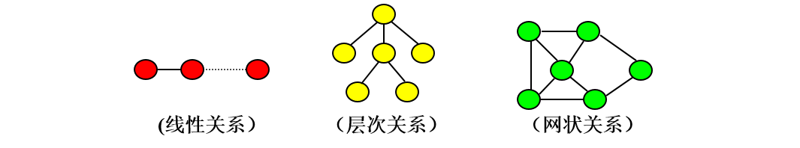
### 	2.存储结构 

+  顺序存储
+  链式存储
+  索引存储
+  散列存储（哈希存储） 

>注：

>1. 若采用**顺序存储**，则各个数据元素在物理上必须是**连续的**;若采用**非顺序存储**，则各个数据元素在物理上可以是**离散的**。
>2. **数据的存储结构会影响存储空间分配的方便程度**

### 	3.数据的运算   

   针对某种逻辑结构，根据需求，定义**基本运算**

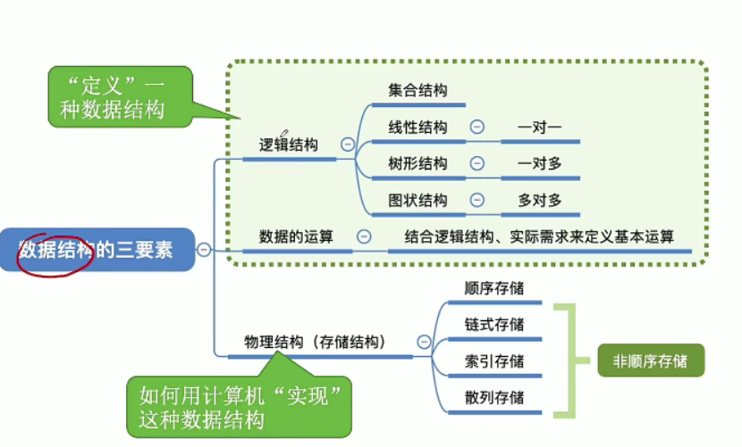

## （三）算法

​	1.算法的含义

算法是对特定问题求解步骤的一种描述,（***程序 = 数据结构 +算法***）

​	2.特性
+ **有穷性**  
 注：算法必须是有穷的，程序是无穷的。
+ **确定性** —— 相同的输入只得出相同的输出
+ **可行性** —— 基本运算执行有限次
+ **输入** —— 一个算法有**零个或多个输入**
+ **输出** —— 一个算法有**一个或多个输出**

​	3.好算法特性
+ **正确性**。算法应能够正确地解决求解问题。
+ **可读性**。算法应具有良好的可读性，以帮助人们理解。
+ **健壮性**，输入非法数据时，算法能适当地做出反应或进行处理，而不会产生莫名其妙的输出结果
+ **高效率与低存储量需求**

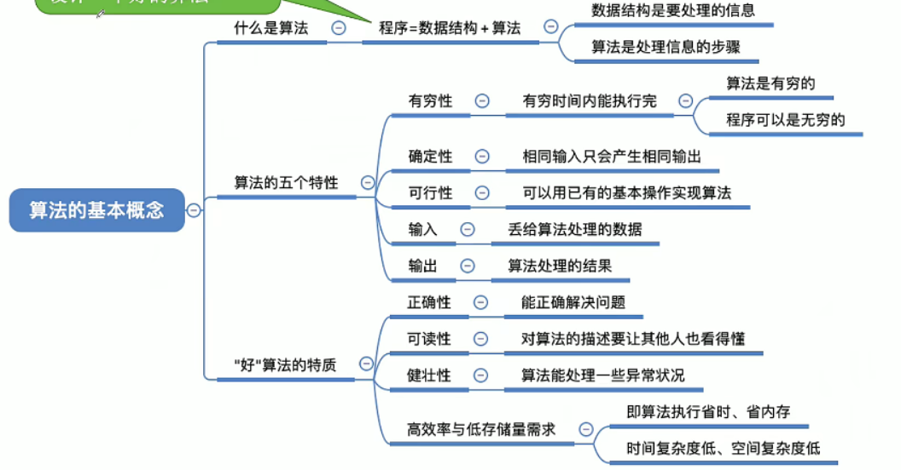

​	4.算法效率的度量

​	(1) 时间复杂度

> * **事前预估算法时间开销T(n)与问题规模n的关系(t-> time)**(逐步递增性)
> 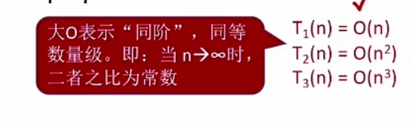
> 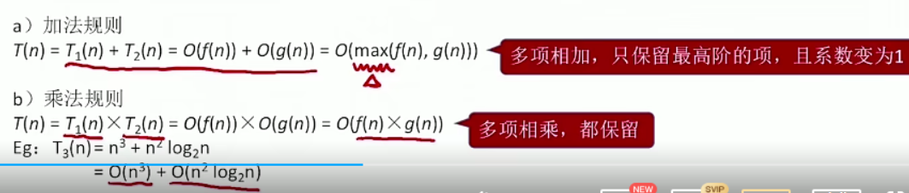
> 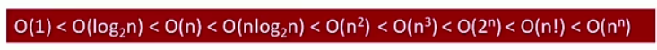
> 口诀：常对幂指阶（越往后阶越大，花费时间越大）
>
> 注：  
> ++ 顺序执行的代码只会影响常数项，可以忽略  
> ++分析时间复杂度只需挑循环中的一个基本操作分析它的执行次数与n的关系即可
> ++若有多层嵌套循环，只需要关注最深层的循环
> 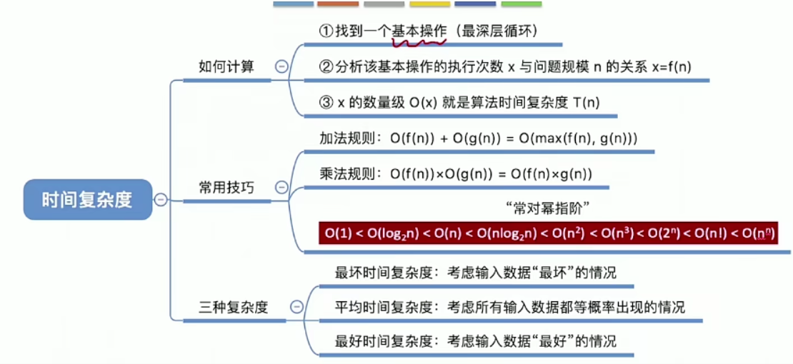
>
> 


​	(2) 空间复杂度

>* 空间复杂度：S(n) = O(1) 或  S(n) = O(n)（递归调用的深度或与问题规模有关）  
>* 算法**原地工作——算法所需内存空间为常量（一般不变）
>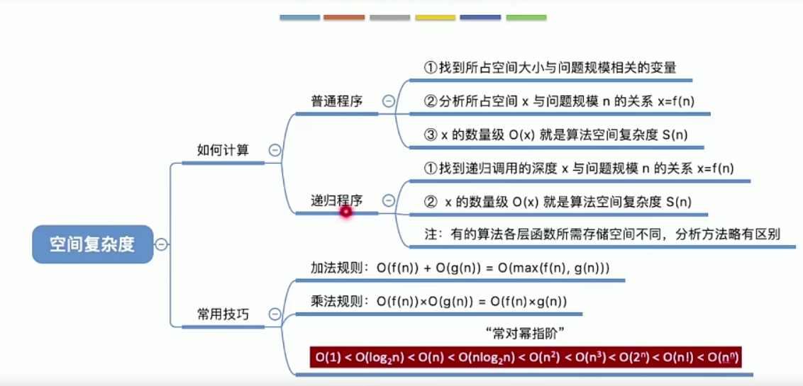

## 二、线性表

* 定义：
>线性表是具有**相同**数据元素的n(n>0）个数据元素的**有限序列**，其中**n为表长**，当n =O时线性表是一个空表。若用L命名线性表，则其一般表示为 l = (a1, a2, …. , a, ajs1, ... , an)  

* 基本操作
>* InitList(&L):初始化表。构造一个空的线性表L，分配内存空间。
>* DestroyList(&L):销毁操作。销毁线性表，并释放线性表L所占用的内存空间。
>* Listlnser&L,i,e):插入操作。在表L中的第i个位置上插入指定元素e。
>* ListDelete(&L,i,&e):删除操作。删除表L中第i个位置的元素，并用e返回删除元素的值。
>* LocateElem(L,e):按值查找操作。在表L中查找具有给定关键字值的元素
>* GetElem(L,i):按位查找操作。获取表L中第i个位置的元素的值。
>* Length(L):求表长。返回线性表L的长度，即L中数据元素的个数。
>* PrintList(L):输出操作。按前后顺序输出线性表L的所有元素值。
>* Empty(L):判空操作。若L为空表，则返回true，否则返回false。

* 存储结构
 * 顺序存储
>顺序表――用顺序存储的方式实现线性表顺序存储。把逻辑上相邻的元素存储在物理位置上也相邻的存储单元中，元素之间的关系由存储单元的邻接关系来体现。
```python
#线性表的顺序存储
lists = [1,2,3]
lists.append(6) #增
lists.remove(3)
tuple = (1,2,3)
```


 * 链式存储
+ 定义
>将线性表L=(a0,a1,……,an-1)中各元素分布在存储器的不同存储块，称为结点，每个结点（尾节点除外）中都持有一个指向下一个节点的引用，这样所得到的存储结构为链表结构。

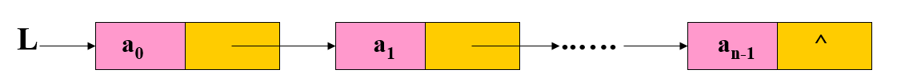

+ 特点
>* 逻辑上相邻的元素 ai, ai+1，其存储位置也不一定相邻；
>* 存储稀疏，不必开辟整块存储空间。
>* 对表的插入和删除等运算的效率较高。
>* 逻辑结构复杂，不利于遍历。
+ 程序实现  (详见文件linklist.py)

```python
# 创建节点类(python)
class Node:
    def __init__(self, val, next=None):
        self.val = val  # 有用数据
        self.next = next  # 循环下一个节点关系


class LinkManager:  # 线性表链式存储
    def __init__(self):
        self.__top = Node(None)

    def create(self,lists):   #新建
        pointer = self.__top  # 相当于指针，初始指向头部
        for item in LinkManager.get_eve(lists):
            pointer.next = Node(item) #将指针的next点挂上数据
            pointer = pointer.next #将指针移动到下一个数据点

    def show_all(self):  #查看所有的数据
        pointer = self.__top  # 相当于指针，初始指向头部
        while pointer.next != None:
            pointer = pointer.next
            print(pointer.val)

    def show(self,index): #根据索引查找
        if index <0 :
            print("索引小于0")
            return
        pointer = self.__top  # 相当于指针，初始指向头部
        count = 0              #计数
        while pointer.next != None:
            pointer = pointer.next
            if count == index:
                print("第{}是{}".format(index,pointer.val))
                break
            count += 1
        else:
            print("索引不正确")

    def insert(self,index,value):  #插入
        if index <0 :
            print("索引小于0")
            return
        pointer = self.__top  # 相当于指针，初始指向头部
        count = 0
        while pointer.next != None:
            if count == index:
                temp = pointer.next
                pointer.next =Node(value,temp)
                break
            pointer = pointer.next
            count += 1
        else:
            pointer.next = Node(value)
            print("索引太大了,因此已为您插在最后了")

    def is_empty(self):
        """
        判断为空
        """
        if self.__top.next is None:
            return True
        return False

    def clear(self): #清空列表
        self.__top.next = None

    def delete(self,index):#根据索引删除

        if index < 0:
            print("索引小于0")
            return
        pointer = self.__top  # 相当于指针，初始指向头部
        count = 0
        while pointer.next  is not None :
            if index == count:
                temp = pointer.next.next
                pointer.next = temp
                break
            pointer = pointer.next
            count += 1
        else:
            print("索引太大")

    def pop(self,value):
        pointer = self.__top  # 相当于指针，初始指向头部
        while pointer.next is not None:
            if pointer.next.val == value:
                temp = pointer.next.next
                pointer.next = temp
                break
            pointer = pointer.next
        else:
            print("链表内不存在该值")
            
            
     def merge(self,lists):#合并链表
        pointer1 = self.__top.next
        pointer2 = lists.__top.next
        while pointer1.next is not None:

            if pointer1.val < pointer2.val:
                temp = pointer1.next
                pointer1.next = pointer2
                pointer1 = pointer1.next
                pointer2 = temp
            else:
                pointer1 = pointer1.next
        else:
            pointer1.next = pointer2

    @staticmethod
    def get_eve(lists):#生成器
        for i in lists:
            yield i

lists = [1,2,3,4]
manager = LinkManager()
manager.create(lists)
manager.insert(0,0)
manager.insert(5,5)
# manager.pop(5)
manager.show_all()
#manager.show(10)


#创建两个链表,两个链表中的值均为有序值将连个链表合并为一个，合并后要求值仍为有序值
manager = LinkManager()
manager.create([1,3,5,7,9,11,12])
manager1 = LinkManager()
manager1.create([2,4,6,8])
manager.merge(manager1)
manager.show_all()  #1 2 3 4 5 6 7 8 9 11 12

```


## 三、栈

1. 定义
>栈是限制在一端进行插入操作和删除操作的线性表（俗称堆栈），允许进行操作的一端称为“栈顶”，另一固定端称为“栈底”，当栈中没有元素时称为“空栈”。

2. 特点：

>* 栈只能在一端进行数据操作
>* 栈模型具有先进后出或者叫做后进先出的规律

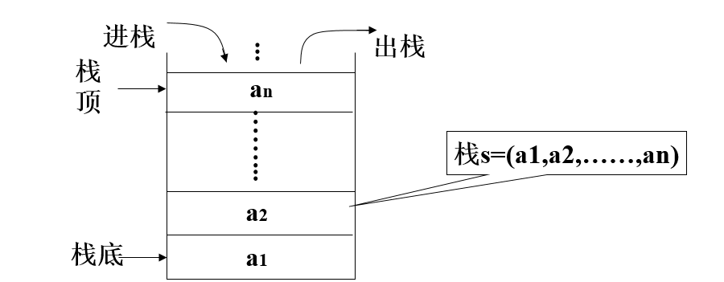

3. 栈的代码实现 

栈的操作有入栈（压栈），出栈（弹栈），判断栈的空满等操作。

```python
#顺序存储

class Inn:
    def __init__(self):
        self.__list = []
    def append(self,value):#尾部插入
        self.__list.append(value)
    
    def pop(self):  #出栈
    	if self.is_empty():
    		raise ValueError()
        return self.__list.pop()
    
    def is_empty(self):
        if len(self.__list)==0:
            return True
        return False
        
        #逆波兰表达式
        """

        逆波兰表达式是一种把运算符后置的算术表达式，逆波兰表达式又叫做后缀表达式。
        逆波兰表达式的优点是运算符之间不必有优先级关系，也不必用括号改变运算顺序。		逆波兰表达式是一种很有用自表达式，它将复杂表达式转换为可以依靠简单的操作得		到计算结果的表达式。
        例如:正常表达式
        逆波兰表达式
        2+3         2 3 +
        2+(3-4)     2 3 + 4 -
        2+(3-4)*5    2 3 + 4 - 5 *
        2+5*(3-4)    2 5 + 3 * 4 -
        本题求解逆波兰表达式的值，其中运界付只影球隔壁稚序猿加、-减、*乘、/除。


        """
        
    def get_result(self):
        while True:
            user_input = input("请输入逆波兰表达式：")
            for item in user_input.split():
                if item == "p":
                    print(self.pop())
                elif item in"+-*/":
                    num = self.pop()
                    num1 = self.pop()
                    temp = eval(num1 +item+num)
                    self.append(str(temp))
                elif item.isdigit():
                    self.append(item)

if __name__ == '__main__':
    mana = Inn()
    mana.get_result()
    


```

```python
#链式存储

# 创建节点类(python)
class Node:
    def __init__(self, val, next=None):
        self.val = val  # 有用数据
        self.next = next  # 循环下一个节点关系
class Inn:
    def __init__(self):
        self.__top = Node #链表的开头作为栈顶

    def append(self, value):  # 尾部插入
        node = Node(value)
        node.next = self.__top
        self.__top= node    #self.__top = Node(value,self.__top)

    def pop(self):  # 出栈
        if self.is_empty():
            raise ValueError("栈为空")
        temp = self.__top.val
        self.__top = self.__top.next
        return temp

    def is_empty(self):
        if self.__top is None:
            return True
        return False

    

if __name__ == '__main__':
    mana = Inn()
    
```


## 四、队列

1. 定义
>队列是限制在两端进行插入操作和删除操作的线性表，允许进行存入操作的一端称为“队尾”，允许进行删除操作的一端称为“队头”。

2. 特点：

>* 队列只能在队头和队尾进行数据操作
>* 队列模型具有先进先出或者叫做后进后出的规律

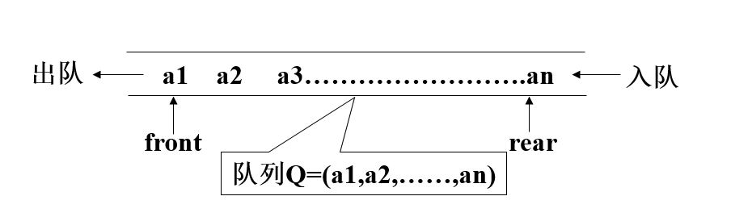

3. 队列的代码实现 

队列的操作有入队，出队，判断队列的空满等操作。

***顺序存储代码实现：***

```python
#顺序队列

class Aueue:
    def __init__(self):
        self.__queue = []

    def is_empty(self):
        return  self.__queue == []

    def append(self,lists):  #入队
        for item in Aueue.get_val(lists):
            self.__queue.append(item)

    def pop(self):#出队
        if self.is_empty():
            raise ValueError("为空")
        return self.__queue.pop(0)


    @staticmethod
    def get_val(lists):
        for item in lists:
            yield item

if __name__ == '__main__':
    queue = Aueue()
    queue.append([0,1,2,3,4])
    print(queue.pop())
    print(queue.pop())
```

***链式存储代码实现： ***

```python
#链式队列
"""
思路分析∶
1．基于链表构建队列模型
2．链表的开端作为队头﹖结尾位置作为队尾
3．单独定义队尾标记﹖避免每次插入数据遍历
4.队头和队尾重叠认为队列为空

"""

class Node:
    """
    思路∶将自定义的类视为节点的生成类,实例对象中
    包含数据部分和指向下一个节点的n e x t

    """
    def __init__ (self,val, next=None):
        self.val = val     #有用数据
        self.next = next   #循环下一个节点关系

class Aueue:
    def __init__(self):
        self.__top = self.__bottom = Node(None)

    def is_empty(self):
        return self.__bottom == self.__top

    def append(self,lists):  #入队
        for item in Aueue.get_val(lists):
            self.__bottom.next =Node(item)
            self.__bottom= self.__bottom.next

    def pop(self):#出队
        if self.is_empty():
            raise ValueError("为空")

        self.__top = self.__top.next
        return self.__top.val


    @staticmethod
    def get_val(lists):
        for item in lists:
            yield item

if __name__ == '__main__':
    queue = Aueue()
    queue.append([0,1,2,3,4])
    print(queue.pop())
    print(queue.pop())
    print(queue.pop())
    print(queue.pop())
    print(queue.pop())

```


## 五、树形结构

###  （一）基础概念 

1. 定义
>树（Tree）是n（n≥0）个节点的有限集合T，它满足两个条件：有且仅有一个特定的称为根（Root）的节点；其余的节点可以分为m（m≥0）个互不相交的有限集合T1、T2、……、Tm，其中每一个集合又是一棵树，并称为其根的子树（Subtree）。

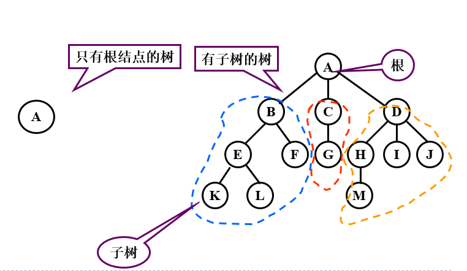


2. 基本概念 

>* 一个节点的子树的个数称为该节点的度数，一棵树的度数是指该树中节点的最大度数。

>* 度数为零的节点称为树叶或终端节点，度数不为零的节点称为分支节点。

>* 一个节点的子树之根节点称为该节点的子节点，该节点称为它们的父节点，同一节点的各个子节点之间称为兄弟节点。一棵树的根节点没有父节点，叶节点没有子节点。

>* 节点的层数等于父节点的层数加一，根节点的层数定义为一。树中节点层数的最大值称为该树的高度或深度。

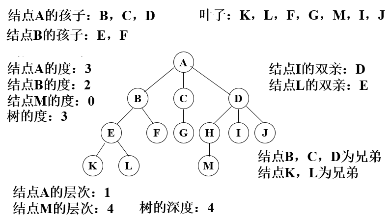

### （二）二叉树

定义与特征

1. 定义
>二叉树（Binary Tree）是n（n≥0）个节点的有限集合，它或者是空集（n＝0），或者是由一个根节点以及两棵互不相交的、分别称为左子树和右子树的二叉树组成。二叉树与普通有序树不同，二叉树严格区分左孩子和右孩子，即使只有一个子节点也要区分左右。

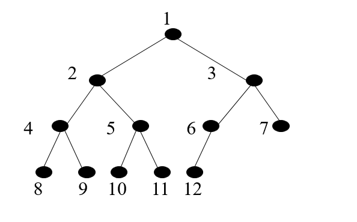

2. 二叉树的特征

* 二叉树第i（i≥1）层上的节点最多为$2^{i-1}$个。
* 深度为k（k≥1）的二叉树最多有$2^k－1$个节点。
* 在任意一棵二叉树中，树叶的数目比度数为2的节点的数目多一。

* 满二叉树 ：深度为k（k≥1）时有$2^k－1$个节点的二叉树。

二叉树的遍历

>遍历 ：沿某条搜索路径周游二叉树，对树中的每一个节点访问一次且仅访问一次。

> 先序遍历： 先访问树根，再访问左子树，最后访问右子树；根左右
> 中序遍历： 先访问左子树，再访问树根，最后访问右子树；左根右
> 后序遍历： 先访问左子树，再访问右子树，最后访问树根；左右根
> 层次遍历:  从根节点开始，逐层从左向右进行遍历。

递归思想和实践

1. 什么是递归？

所谓递归函数是指一个函数的函数体中直接调用或间接调用了该函数自身的函数。这里的直接调用是指一个函数的函数体中含有调用自身的语句，间接调用是指一个函数在函数体里有调用了其它函数，而其它函数又反过来调用了该函数的情况。

2. 递归函数调用的执行过程分为两个阶段

>递推阶段：从原问题出发，按递归公式递推从未知到已知，最终达到递归终止条件。
>回归阶段：按递归终止条件求出结果，逆向逐步代入递归公式，回归到原问题求解。

3. 优点与缺点

>优点：递归可以把问题简单化，让思路更为清晰,代码更简洁
>缺点：递归因系统环境影响大，当递归深度太大时，可能会得到不可预知的结果


二叉树的代码实现

二叉树顺序存储

二叉树本身是一种递归结构，可以使用Python list 进行存储。但是如果二叉树的结构比较稀疏的话浪费的空间是比较多的。

* 空结点用None表示
* 非空二叉树用包含三个元素的列表[d,l,r]表示，其中d表示根结点，l，r左子树和右子树。

```

['A',['B',None,None
     ],
     ['C',['D',['F',None,None],
               ['G',None,None],
          ],     
          ['E',['H',None,None],
               ['I',None,None],
          ],
     ]
]
```

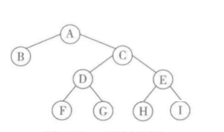

二叉树链式存储

```python
"""
链式树的遍历（使用递归思想)
"""
import squeue

class Node:
    """
    思路∶将自定义的类视为节点的生成类,实例对象中
    包含数据部分和指向左右节点

    """
    def __init__ (self,val,left=None,right=None):
        self.val = val     #有用数据
        self.left = left   #左节点关系
        self.right = right   #右节点关系

class BiTree:
    def __init__(self,root):
        self.root =root

    def preorder(self,node):
        """
        前序遍历（根左右）
        :param node:根节点
        :return:
        """
        if node is None:
            return
        print(node.val)
        self.preorder(node.left)
        self.preorder(node.right)

    def infix_order (self,node):
        """
        中序遍历（根左右）
        :param node:根节点
        :return:
        """
        if node is None:
            return
        self.infix_order(node.left)
        print(node.val)
        self.infix_order(node.right)

    def epilogue (self,node):
        """
        后序遍历（根左右）
        :param node:根节点
        :return:
        """
        if node is None:
            return
        self.epilogue(node.left)
        self.epilogue(node.right)
        print(node.val)

    def level(self,node):
        """让初始节点先入队﹖谁出队就遍历谁﹐并
        且让它的左右孩子分别入队﹐直到队列为空"""
        sq = squeue.SQueue()
        sq.enqueue(node)  # 初始节点入队while not sq.is_empty() :
        node = sq.dequeue()  # 打印出队元素
        print(node.val, end='')
        if node.left:
            sq.enqueue(node.left)
        if node.right:
            sq.enqueue(node.right)


if __name__ == '__main__':
    #B F G D I H E C A
    b = Node("B")
    f = Node("F")
    g = Node("G")
    d = Node("D",f,g)
    h = Node("H")
    i = Node("I")
    e = Node("E",h,i)
    c = Node("C",d,e)
    a = Node("A",b,c)  #根节点
    tree = BiTree(a)
    tree.preorder(a)
```


## 六、排序和查找

### （一）排序

排序(Sort)是将无序的记录序列（或称文件）调整成有序的序列。排序方法有很多种，下面举例说明：

* 冒泡排序

>冒泡排序是一种简单的排序算法。它重复地走访过要排序的数列，一次比较两个元素，如果他们的顺序错误就把他们交换过来。走访数列的工作是重复地进行直到没有再需要交换，也就是说该数列已经排序完成。
>
>

* 选择排序

> 
>
> 

* 插入排序

> 
>
> 

* 快速排序

>步骤:
>>从数列中挑出一个元素，称为 "基准"（pivot），
>>重新排序数列，所有元素比基准值小的摆放在基准前面，所有元素比基准值大的摆在基准的后面（相同的数可以到任一边）。在这个分区退出之后，该基准就处于数列的中间位置。这个称为分区（partition）操作。
>>递归地（recursive）把小于基准值元素的子数列和大于基准值元素的子数列排序。
>
>

***常见排序代码实现：***

```python
#（冒泡排序）
lists = [1,5,3,15,7,26,15,8]
for i in range(len(lists)-1):
    for j in range(i,len(lists)):
        if lists[j]<lists[i]:
            lists[j],lists[i] = lists[i],lists[j]
#选择排序
for i in range(len(lists)-1):
    min_num = lists[i]   #假设 min_num是最小的
    count = i            #记录索引号
    for j in range(i+,len(lists)):
        if lists[j] <min_num:
            min_num = lists[j]
            count = j
    if count != i:
    	lists[i],list[count] = list[count],list[i]
#插入排序  
for i in range(1,len(lists)):
    while i >=0:
        if lists[i]<lists[i-1]:
            lists[i],lists[i-1] =lists[i-1],list[i]
            count -= 1
        else:
            break
         
        
    
#快速排序 
"""
递归思想
i = 0 ->                        <- j= -1

        10 6 8 12 4 7 11 15 9 13
x = lists[0]
从后往前
凡是比10小的往前摔，否则往后摔
i = 0 ->                   <- j= -2

        9 6 8 12 4 7 11 15 0 13
        
      i = 1 ->             <- j= -2

        9 6 8 12 4 7 11 15 0 13         
        
        
直到 i = j时  lists[i] = x
 

        9 6 8 7 4 10 11 15 12 13       

进行下一轮
x = 9                x = 11
		9 6 8 7 4    11 15 12 13           
		
		4 6 8 7 9    11  15  12 13
		
进行下一轮
		x= 4         x= 15
		4 6 8 7      15  12 13
		4 6 8 7      13  12 15
进行下一轮
		x= 6         x= 13
		6 8 7         13  12
		
"""
def sub_sort(list,i,j):
    result = list[i]
    while i<j:
        while result<= list[j] and j>i: 
            j -= 1
        else:
            list[i],list[j] = list[j],list[i]
            
        while result >list[i] and i<j:
            i += 1
        else:
            list[i],list[j] = list[j],list[i]
    list[i] = result
    return i

def fast_sort(list):
    i = 0           #起始位置 索引
    j = len(list) -1
    if i< j:
        temp=sub_sort(list,i ,j)
        fast_sort(list,i,temp-1)
        fast_sort(list,temp+1,j)
        
    
    
```


### （二）查找

查找(或检索)是在给定信息集上寻找特定信息元素的过程。

##### 二分法查找

当数据量很大适宜采用该方法。采用二分法查找时，数据需是排好序的。

***二分查找代码实现：***

```python
#二分查找
lists = [1,5,6,10,15,20,35,50,75,81,89,99]
def get_num(lists,num):
    index = len(lists)//2
    if lists[index] == num:
        return index
    elif lists[index] < num:
        get_num(lists[0:index-1])
    else:
        get_num(lists[index+1:])
```

