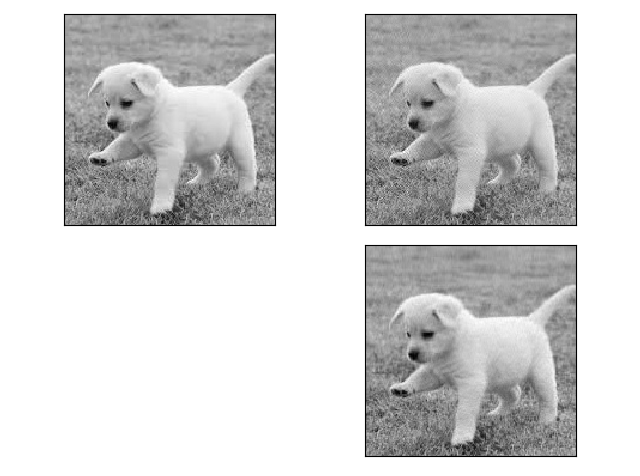
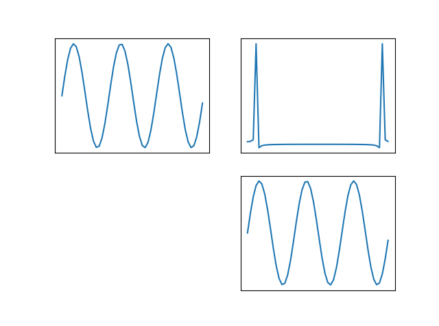
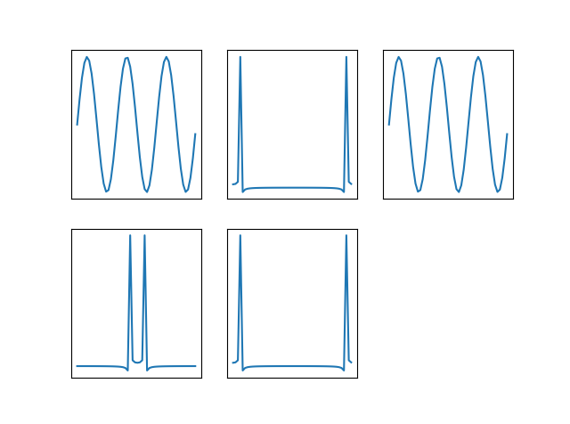
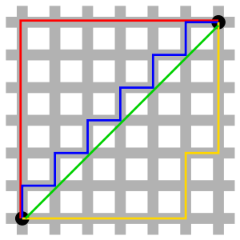
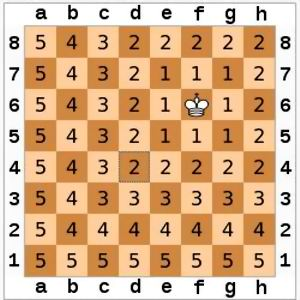
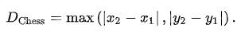
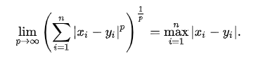
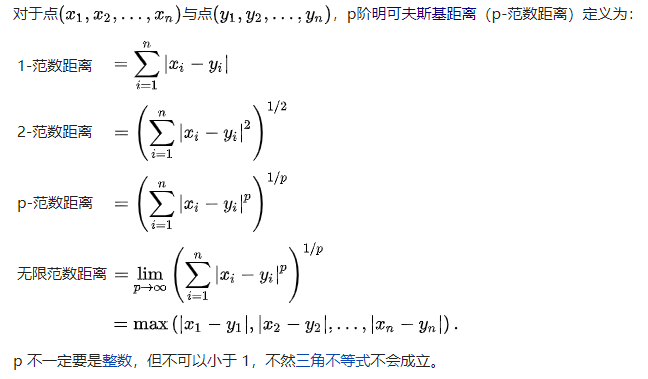
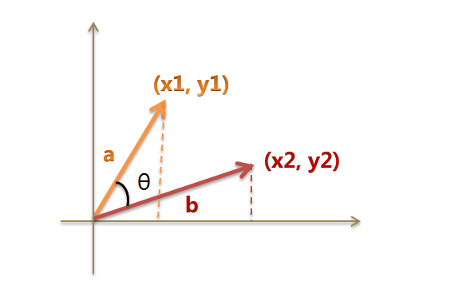

## 标量、向量、矩阵、相关运算与性质

### 标量（scalar）

　　**标量**（**Scalar**）又称**纯量**，一个标量就是一个单独的数或者字符，一般用小写的变量名称表示。

###  向量（vector）

　　**向量**（vector）又称**矢量**，一个向量就是一组数，这些数是有序排列的。可以按照索引的序列确定每个单独的数。在几何空间中可以代表一个“点”，也可表示为空间坐标系原点到这个点的有向线段。

表示：大写字母或者带箭头的字符 $\vec a, \overrightarrow{AB}$ .
$$
A = 
\left[
\begin{array}{c}
红色\\
橙色\\
黄色\\
\end{array}
\right]
\quad\quad\quad 
B = 
\left[
\begin{array}{c}
7.5\\
6.8\\
5.2\\
\end{array}
\right]
\quad\quad\quad 
C = 
\left[
\begin{array}{c}
7.1\\
7.4\\
10.3\\
\end{array}
\right]
$$
性质：有向线段，有大小，有夹角。

### 向量化（vectorize）

向量化指的是用数组代替标量来操作数组里的每个元素。

numpy提供了vectorize函数，可以把处理标量的函数向量化，返回的函数可以直接处理ndarray数组。

```python
# 向量化 Vectorize
def myfunc(a, b):
    if a>b:
        return a-b
    else:
        return a+b
func = np.vectorize(myfunc)
a = [1, 2, 3, 4]
b = 2
print(func(a, b))
[3 4 1 2]
```

用frompyfuc函数求：

```python
# frompyfunc函数
fun = np.frompyfunc(myfunc, 2, 1)
# 2 为myfunc中的参数个数
# 1 为myfunc中的返回值的个数
print(fun(a, b))
[3 4 1 2]
```

###  矩阵（matrix）

　　矩阵是具有相同特征和维度的对象的集合，表现为一张二维数据表。其意义是一个对象表示为矩阵中的一行，一个特征表示为矩阵中的一列，每个特征都有数值型的取值。 
　　把上述多个列向量沿水平方向合并在一起，就形成了m行n列的“数据表”。称为m行n列的“矩阵”。矩阵属于二维数据结构。
$$
D = \begin{bmatrix}
红色 & 7.5 & 7.1\\
橙色 & 6.8 & 7.4\\
黄色 & 5.2 & 10.3\\
  \end{bmatrix}
$$

### 矩阵的运算

#### **矩阵的加减法**

${\displaystyle m\times n}$ 矩阵 ${\displaystyle \mathbf {A} }$ 和 ${\displaystyle \mathbf {B} }$ 的和（差）：${\displaystyle \mathbf {A} \pm \mathbf {B} }$ 为一个 ${\displaystyle m\times n}$ 矩阵，其中每个元素是 ${\displaystyle \mathbf {A} }$ 和 ${\displaystyle \mathbf {B} }$ 相应元素的和（差）,

$(\mathbf {A}+\mathbf {B})_{i,j}=\mathbf {A} _{i,j}\pm \mathbf {B} _{i,j}$ , 其中 $1 \leq i \leq m, 1 \leq j \leq n$ . 
$$
10 + 
\left[
\begin{array}{c}
1 & 2\\
4 & 5\\
7 & 8\\
\end{array}
\right]
= 
\left[
\begin{array}{c}
11 & 12\\
14 & 15\\
17 & 18\\
\end{array}
\right]

\quad\quad\quad

\left[
\begin{array}{c}
1 & 2\\
3 & 4\\
5 & 6\\
\end{array}
\right]
+ 
\left[
\begin{array}{c}
1 & 2\\
3 & 4\\
5 & 6\\
\end{array}
\right]
= 
\left[
\begin{array}{c}
2 & 4\\
6 & 8\\
10 & 12\\
\end{array}
\right]
$$

$$
10 - 
\left[
\begin{array}{c}
1 & 2\\
3 & 4\\
5 & 6\\
\end{array}
\right]
= 
\left[
\begin{array}{c}
9 & 8\\
7 & 6\\
5 & 4\\
\end{array}
\right]
​
\quad\quad\quad\quad
​
\left[
\begin{array}{c}
1 & 2\\
3 & 4\\
5 & 6\\
\end{array}
\right]
-
\left[
\begin{array}{c}
1 & 1\\
\end{array}
\right]
= 
\left[
\begin{array}{c}
0 & 1\\
2 & 3\\
4 & 5\\
\end{array}
\right]
$$

#### 数与矩阵相乘

标量 ${\displaystyle c}$ 与矩阵${\displaystyle \mathbf {A} }$ 的数乘： ${\displaystyle c\mathbf {A} }$ 的每个元素是A的相应元素与c的乘积，

$ (cA)_{i,j}=c \cdot A_{i,j} $
$$
10 \times 
\left[
\begin{array}{c}
1 & 2\\
4 & 5\\
7 & 8\\
\end{array}
\right]
= 
\left[
\begin{array}{c}
10 & 20\\
40 & 50\\
70 & 80\\
\end{array}
\right]

\quad\quad\quad
$$


#### 矩阵与矩阵相乘

两个矩阵的乘法仅当第一个矩阵A的列数(column)和另一个矩阵B的行数(row)相等时才能定义。

如A是m x n 矩阵和B是 n x p矩阵，它们的乘积AB 是一个m x p 矩阵，它的一个元素
$$
[AB]_{i,j}=A_{i,1} B_{1,j}+A_{i,2} B_{2,j}+...+A_{i,n} B_{n,j}=\sum_{r=1}^n A_{i,r} B_{r,j}
\\
其中 1 \leq i \leq m, 1 \leq j \leq n
$$

$$
\left[
\begin{array}{c}
1 & 2 & 3\\
4 & 5 & 6\\
\end{array}
\right]
\times 
\left[
\begin{array}{c}
1 & 2\\
3 & 4\\
5 & 6\\
\end{array}
\right]
= 
\left[
\begin{array}{c}
22 & 28\\
49 & 64\\
\end{array}
\right]
$$

### matrix和ndarray区别：

矩阵和数组的区别主要有两点：

 1). 乘法规则有所不同， 如果是array那么乘法是对应元素的乘积作为结果对应位置上的值，而如果是matrix则需要满足第一个矩阵的列等于第二个矩阵的行的要求才能乘。

```python
x = np.matrix([[1, 3, 5], [2, 4, 6]])
y = np.matrix([[7, 9, 11], [8, 10, 12]])

# 矩阵乘法
print(x * y.T, "# x * y.T")
print(np.matmul(x, y.T), "# np.matmul(x, y.T)")

# 元素相乘
print(np.multiply(x, y), "# matrix multiply")

'''
[[ 89  98]
 [116 128]] # x * y.T
 
[[ 89  98]
 [116 128]] # np.matmul(x, y.T)
 
[[ 7 27 55]
 [16 40 72]] # matrix multiply
'''
```

2). 数组和矩阵的shape不同。

```python
w = np.array([1, 2, 4])
print("ndarray", w.shape,w.T.shape)

v = np.matrix([1, 2, 4])
print("matrix ", v.shape,v.T.shape)

ndarray (3,) (3,)
matrix  (1, 3) (3, 1)
```

**矩阵对象的创建**

```python
x = np.matrix([[1, 3, 5], [2, 4, 6]])
y = np.matrix("1,2,3;4,5,6;7,8,9")
```


### 特殊矩阵

**方阵：** 行数与列数相等的矩阵为方阵。n x n
$$
\left[\begin{array}{c}1 & 2\\3 & 4\\\end{array}\right]\quad\quad\quad\left[\begin{array}{c}1 & 2 & 2\\3 & 4 & 4\\3 & 4 & 4\\\end{array}\right]
$$
**零矩阵：** 矩阵中每个元素都为0。
$$
\left[\begin{array}{c}0 & 0 & 0\\0 & 0 & 0\\0 & 0 & 0\\\end{array}\right]
$$
**对角矩阵：**    主对角线之外的元素都是0的矩阵。
$$
\left[
\begin{array}{c}
1 & 0 & 0\\
0 & 2 & 0\\
0 & 0 & 3\\
\end{array}
\right]
$$
**单位矩阵：** 主对角线元素都是1的对角矩阵。
$$
\left[
\begin{array}{c}
1 & 0 & 0\\
0 & 1 & 0\\
0 & 0 & 1\\
\end{array}
\right]
$$


### 矩阵的转置 (Transpose)

把矩阵A的行换成同序数的列得到一个新矩阵，叫做矩阵A的转置矩阵， 记为 $A^T$ .
$$
A = \begin{bmatrix}
1 & 3 & 5\\
2 & 4 & 6\\
  \end{bmatrix}
则 \quad 
A^T=\begin{bmatrix}
1 & 2 \\
3 & 4\\
5 & 6\\
  \end{bmatrix}
$$


```python
x = np.array([[1, 3, 5], [2, 4, 6]])
y = np.array([[7, 9, 11], [8, 10, 12]])
print(x.T)
print(y.T)

'''
[[1 2]
 [3 4]
 [5 6]]
 
[[ 7  8]
 [ 9 10]
 [11 12]]
'''
```


### 矩阵的逆 (inverse matrix)

**矩阵的逆矩阵**

若两个矩阵A、B满足：AB = BA = E （E为单位矩阵），则成为A、B为逆矩阵。

```python
e = np.mat('1 2 6; 3 5 7; 4 8 9')
print(e.I)
print(e * e.I)
```

ndarray提供了方法让多维数组替代矩阵的运算： 

```python
a = np.array([
    [1, 2, 6],
    [3, 5, 7],
    [4, 8, 9]])
# 点乘法求ndarray的点乘结果，与矩阵的乘法运算结果相同
k = a.dot(a)
print(k)
# linalg模块中的inv方法可以求取a的逆矩阵
l = np.linalg.inv(a)
print(l)
```


### 特征值和特征向量 (Eigenvalues and eigenvectors)

对于n阶方阵A，如果存在数a和非零n维列向量x，使得Ax=ax，则称a是矩阵A的一个特征值，x是矩阵A属于特征值a的特征向量。

```python
#已知n阶方阵A， 求特征值与特征数组
# eigvals: 特征值数组
# eigvecs: 特征向量数组 
eigvals, eigvecs = np.linalg.eig(A)
```


案例：读取图片的亮度矩阵，提取特征值与特征向量，保留部分特征值，重新生成新的亮度矩阵，绘制图片。

```python
'''
特征值与特征向量
'''
import numpy as np
import scipy.misc as sm
import matplotlib.pyplot as mp

# 读取图片数据
img = sm.imread('dog.jpg', True)
print(img.shape)

# 提取img矩阵的特征值与特征向量
img = np.mat(img)
eigvals, eigvecs = np.linalg.eig(img)
print("特征值，特征向量：", eigvals.shape, eigvecs.shape)

# 抹掉一部分特征值
eigvals[150:] = 0
img2 = eigvecs * np.diag(eigvals) * eigvecs.I
img2 = img2.real
print(img2.dtype)

mp.figure('Dog')
mp.subplot(121)
mp.imshow(img, cmap='gray')
mp.xticks([])
mp.yticks([])

mp.subplot(122)
mp.imshow(img2, cmap='gray')
mp.xticks([])
mp.yticks([])
mp.tight_layout()
mp.show()

```


### 奇异值分解

有一个矩阵M，可以分解为3个矩阵U、S、V，使得U x S x V等于M。U与V都是正交矩阵（乘以自身的转置矩阵结果为单位矩阵）。那么S矩阵主对角线上的元素称为矩阵M的奇异值，其它元素均为0。

```python
import numpy as np

M = np.mat('1 2 3;4 5 6;7 8 9')
U, sv, V = np.linalg.svd(M)
print(U.shape)
print(V.shape)
print(sv.shape)
print(U * np.diag(sv) * V)
'''
(3, 3)
(3, 3)
(3,)

[[1. 2. 3.]
 [4. 5. 6.]
 [7. 8. 9.]]
'''

```


案例：读取图片的亮度矩阵，提取奇异值与两个正交矩阵，保留部分奇异值，重新生成新的亮度矩阵，绘制图片。

```python
# 奇异值分解
U, sv, V = np.linalg.svd(img)
sv[50:] = 0
img3 = U * np.diag(sv) * V

mp.subplot(224)
mp.imshow(img3, cmap='gray')
mp.xticks([])
mp.yticks([])
```




## 快速傅里叶变换( Fast Fourier Transformation )

傅里叶定理：

法国科学家傅里叶提出，任何一条周期曲线，无论多么跳跃或不规则，都能表示成一组光滑正弦曲线叠加之和。

傅里叶变换：

即是基于傅里叶定理对一条周期曲线进行拆解的过程，最终得到一组光滑的正弦曲线。

傅里叶变换的目的是可将时域（即时间域）上的信号转变为频域（即频率域）上的信号。

假设有一时间域函数：**y = f(x)**，根据傅里叶的理论它可以被分解为一系列正弦函数的叠加，他们的振幅A，频率&omega;或初相位&phi;不同：
$$
y = A_1sin(\omega_1x+\phi_1) +  A_2sin(\omega_2x+\phi_2) +  A_2sin(\omega_2x+\phi_2) + R
$$


numpy中有一个fft库，scipy中也有一个fftpack库，两者的用法基本一致。

### **傅里叶变换相关函数**

```python
import matplotlib.pyplot as mp
import numpy as np

x = np.linspace(0, 5 * np.pi+3, 50)
wave = np.sin(x)
transformed = np.fft.fft(wave)
# 绘制wave图像
mp.figure('FFT')
mp.subplot(221)
mp.plot(wave)
mp.xticks([])
mp.yticks([])
# 将wave进行傅里叶变换
mp.subplot(222)
mp.plot(transformed)
mp.xticks([])
mp.yticks([])
# 进行逆向傅里叶变换
mp.subplot(223)
mp.plot(np.fft.ifft(transformed))
mp.xticks([])
mp.yticks([])
mp.show()
```



#### 移频

 numpy.fft模块中的fftshift函数可以将FFT输出中的直流分量移动到频谱的中央。ifftshift函数则是其逆操作。 

```python
# 移频
shifted = np.fft.fftshift(transformed)
mp.subplot(234)
mp.plot(shifted)
mp.xticks([])
mp.yticks([])
# 还原移频
mp.subplot(235)
mp.plot(np.fft.ifftshift(shifted))
mp.xticks([])
mp.yticks([])
```



## 距离算法

### 1. 欧式距离 (Euclidean Distance) 

在数学中，**欧几里得距离**或**欧氏距离**是欧几里得空间中两点间“普通”（即直线）距离。使用这个距离，欧氏空间成为度量空间。使用这个距离，欧氏空间成为度量空间。相关联的范数 $ L_2$ 称为欧几里得范数。(向量 $L_2$ 范数也称作向量的模)
$$
𝑑_{x,y}=\sqrt{(𝑥_1−𝑥_2)^2+(𝑦_1−𝑦_2)^2}
$$


```python
import numpy as np

# 求欧氏距离
a = np.array([1, 2, 3, 4, 5])
b = np.array([6, 7, 8, 9, 10])

dis_1 = np.sqrt(np.sum(np.square(a - b)))
dis_2 = np.linalg.norm(a - b)
print(dis_1)
print(dis_2)
11.180339887498949
11.180339887498949
```


### 2. 曼哈顿距离（街区距离） (Manhattan Distance) 

曼哈顿距离的命名原因是从规划为方型建筑区块的城市（如曼哈顿）间，最短的行车路径而来（忽略曼哈顿的单向车道以及只存在于3、14大道的斜向车道）。任何往东三区块、往北六区块的的路径一定最少要走九区块，没有其他捷径。
$$
𝑑_{x,y}=|𝑥_1−𝑥_2 |+|𝑦_1−𝑦_2|
$$


```python
# 求曼哈顿距离
dis_3 = np.sum(np.abs(a - b))
dis_4 = np.linalg.norm(a - b, ord= 1)
print(dis_3)
print(dis_4)
25
25.0
```


### 3.切比雪夫距离（棋盘距离） (Chebyshev Distance) 

国际象棋棋盘上二个位置间的切比雪夫距离是指王要从一个位子移至另一个位子需要走的步数。由于王可以往斜前或斜后方向移动一格，因此可以较有效率的到达目的的格子。其又称无限范数距离。在二维空间里，为国王在棋盘上的两个方块间移动所需之最少步数。



在平面几何中，若二点*p*及*q*的直角坐标系坐标为 ${\displaystyle (x_{1},y_{1})}$及${\displaystyle (x_{2},y_{2})}$，则切比雪夫距离为



所以位置F6和位置E2的切比雪夫距离为4。任何一个不在棋盘边缘的位置，和周围八个位置的切比雪夫距离都是1。



```python
# 求切比雪夫距离
dis_5 = np.max(np.abs(a - b))
dis_6 = np.linalg.norm(a - b, ord= np.inf)
print(dis_5)
print(dis_6)
5
5.0
```


### 3. 明氏距离（Minkowski Distance ）

**明氏距离**又叫做明可夫斯基距离，是欧氏空间中的一种测度，被看做是欧氏距离和曼哈顿距离的一种推广。
$$
𝑑_{x,y}=\bigg(\sum_{k=1}^n (x_{1k} - x_{2k})\bigg) ^{\frac{1}{p}}
$$
当p=1时，是曼哈顿距离，相关联的范数 $ L_1$ 称为欧几里得范数。

当p=2时，是欧氏距离，相关联的范数 $ L_2$ 称为欧几里得范数。

当p趋于正无穷时，是切比雪夫距离，又称无限范数距离。



```python
np.linalg.norm(x, y, ord = p )
'''
其中p是一个变参数
当p=1时，就是曼哈顿距离
当p=2时，就是欧氏距离
当p→∞时，就是切比雪夫距离
根据变参数的不同，闵氏距离可以表示一类的距离
'''
ord : {non-zero int, inf, -inf, 'fro', 'nuc'}, optional
```


### 4. 夹角余弦相似度 (CosineSimilarity)


$$
𝑐𝑜𝑠\theta=\frac{\vec{a} × \vec{b}}{|\vec{a}||\vec{b}|}=\frac{𝑥_1 𝑥_2+𝑦_1 𝑦_2}{\sqrt{𝑥_1^2+𝑦_1^2}\sqrt{𝑥_2^2+𝑦_2^2 } }
$$


```python
# 求夹角余弦相似度
op7=np.dot(a,b)/(np.linalg.norm(a)*(np.linalg.norm(b)))
print(op7)
0.9649505047327671
```

