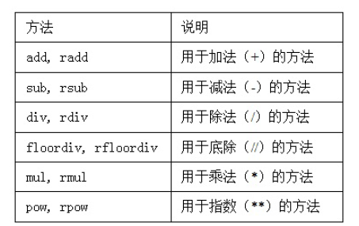
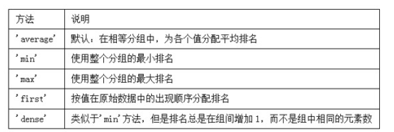
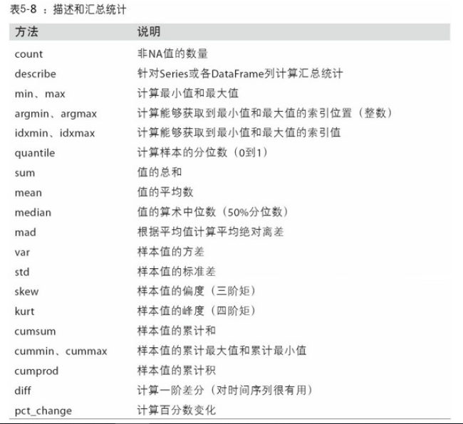
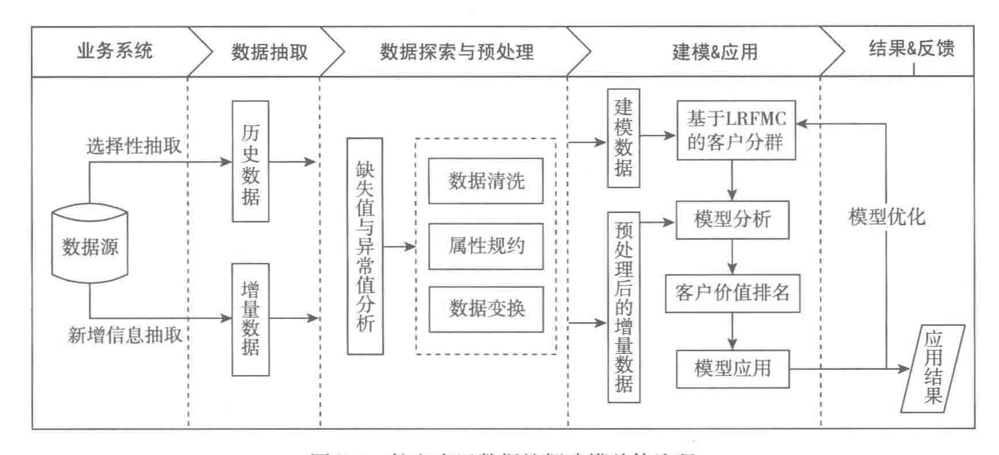
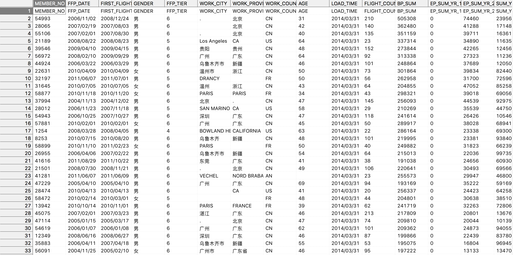
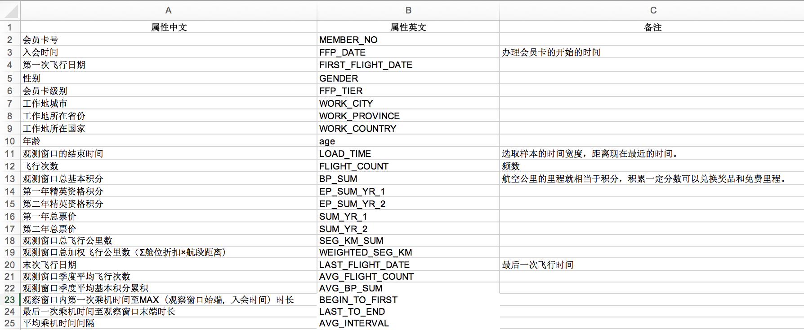
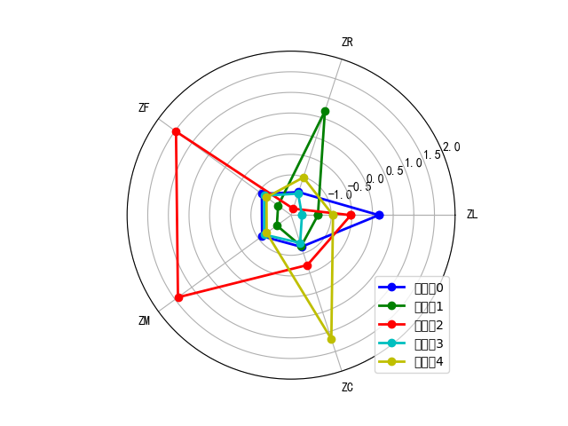

## pandas基础

### pandas的数据结构：

#### Series

Series是⼀种类似于⼀维数组的对象，它由⼀组数据（各种NumPy数据类型）以及⼀组与之相关的数据标签（即索引）组成。

```python
import pandas as pd
from pandas import Series, DataFrame
import numpy as np
np.random.seed(12345)

# Series
obj = pd.Series([4, 7, -5, 3])
print(obj)
d    4
b    7
a   -5
c    3
```


#### DataFrame

DataFrame是⼀个表格型的数据结构，它含有⼀组有序的列，每列可以是不同的值类型（数值、字符串、布尔值等）。

```python
data = {'state': ['Ohio', 'Ohio', 'Ohio', 'Nevada', 'Nevada', 'Nevada'],
        'year': [2000, 2001, 2002, 2001, 2002, 2003],
        'pop': [1.5, 1.7, 3.6, 2.4, 2.9, 3.2]}
frame = pd.DataFrame(data)
print(frame)
```


### 索引对象 index

pandas的索引对象负责管理轴标签和其他元数据（⽐如轴名称等）。

```python
obj = pd.Series(range(3), index=['a', 'b', 'c'])
index = obj.index
print(index)
Index(['a', 'b', 'c'], dtype='object')

print(index[1:])
Index(['b', 'c'], dtype='object')
```


### 重新索引 reindex

reindex，其作⽤是创建⼀个新对象，它的数据符合新的索引。

```python
obj = pd.Series([4.5, 7.2, -5.3, 3.6], index=['d', 'b', 'a', 'c'])
print(obj)
d    4.5
b    7.2
a   -5.3
c    3.6

obj2 = obj.reindex(['a', 'b', 'c', 'd', 'e'])
print(obj2)
a   -5.3
b    7.2
c    3.6
d    4.5
e    NaN

```


### 使⽤ffill实现前向值填充：

```python
obj3 = pd.Series(['blue', 'purple', 'yellow'], index=[0, 2, 4])
print(obj3)
0      blue
2    purple
4    yellow

# 前向插值补充
print(obj3.reindex(range(6), method='ffill'))
0      blue
1      blue
2    purple
3    purple
4    yellow
5    yellow

# 后向插值补充
print(obj3.reindex(range(6), method='bfill'))
0      blue
1    purple
2    purple
3    yellow
4    yellow
5       NaN
```


### 丢弃指定轴的项 drop

```python
# 删除
data = pd.DataFrame(np.arange(16).reshape((4, 4)),
                    index=['Ohio', 'Colorado', 'Utah', 'New York'],
                    columns=['one', 'two', 'three', 'four'])
print(data)
          one  two  three  four
Ohio        0    1      2     3
Colorado    4    5      6     7
Utah        8    9     10    11
New York   12   13     14    15

print(data.drop(['Colorado', 'Ohio']))
          one  two  three  four
Utah        8    9     10    11
New York   12   13     14    15

print(data.drop('two', axis=1))
          one  three  four
Ohio        0      2     3
Colorado    4      6     7
Utah        8     10    11
New York   12     14    15

print(data.drop(['two', 'four'], axis='columns'))
          one  three
Ohio        0      2
Colorado    4      6
Utah        8     10
New York   12     14

data.drop('Utah', inplace=True)
print(data)
          one  two  three  four
Ohio        0    1      2     3
Colorado    4    5      6     7
New York   12   13     14    15
```

 inplace = True：不创建新的对象，直接对原始对象进行修改；

 inplace = False：对数据进行修改，创建并返回新的对象承载其修改结果。

 默认是False，即创建新的对象进行修改，原对象不变，和深复制和浅复制有些类似。


### 用loc和iloc进行选取

使⽤轴标签（loc）或整数索引（iloc），从DataFrame选择⾏和列的⼦集。

 

```python
# loc 和 iloc
data = pd.DataFrame(np.arange(16).reshape((4, 4)),
                    index=['Ohio', 'Colorado', 'Utah', 'New York'],
                    columns=['one', 'two', 'three', 'four'])
print(data)
          one  two  three  four
Ohio        0    1      2     3
Colorado    4    5      6     7
Utah        8    9     10    11
New York   12   13     14    15
print(data.loc['Colorado', ['two', 'three']])
two      5
three    6
Name: Colorado, dtype: int64

print(data.iloc[2, [3, 0, 1]])
four    11
one      8
two      9
Name: Utah, dtype: int64
        
print(data.iloc[[1, 2], [3, 0, 1]])
          four  one  two
Colorado     7    4    5
Utah        11    8    9

print(data.loc[  :'Utah', 'two'])
Ohio        1
Colorado    5
Utah        9
Name: two, dtype: int64
        
print(data.iloc[:, :3][data.three > 5])
          one  two  three
Colorado    4    5      6
Utah        8    9     10
New York   12   13     14
```


### 算数运算和数据对齐

```python
# 算数运算和数据对齐
s1 = pd.Series([7.3, -2.5, 3.4, 1.5], index=['a', 'c', 'd', 'e'])
s2 = pd.Series([-2.1, 3.6, -1.5, 4, 3.1],
               index=['a', 'c', 'e', 'f', 'g'])
print(s1)
a    7.3
c   -2.5
d    3.4
e    1.5

print(s2)
a   -2.1
c    3.6
e   -1.5
f    4.0
g    3.1

print(s1+s2)
a    5.2
c    1.1
d    NaN
e    0.0
f    NaN
g    NaN

df1 = pd.DataFrame(np.arange(9.).reshape((3, 3)), columns=list('bcd'),
                   index=['Ohio', 'Texas', 'Colorado'])

df2 = pd.DataFrame(np.arange(12.).reshape((4, 3)), columns=list('bde'),
                   index=['Utah', 'Ohio', 'Texas', 'Oregon'])
print(df1)
            b    c    d
Ohio      0.0  1.0  2.0
Texas     3.0  4.0  5.0
Colorado  6.0  7.0  8.0

print(df2)
          b     d     e
Utah    0.0   1.0   2.0
Ohio    3.0   4.0   5.0
Texas   6.0   7.0   8.0
Oregon  9.0  10.0  11.0

print(df1+df2)
            b   c     d   e
Colorado  NaN NaN   NaN NaN
Ohio      3.0 NaN   6.0 NaN
Oregon    NaN NaN   NaN NaN
Texas     9.0 NaN  12.0 NaN
Utah      NaN NaN   NaN NaN

```


### 在算术方法中填充值

使⽤df1的add⽅法，传⼊df2以及⼀个fill_value参数

```python
# 在算术⽅法中填充值 fill_value
print(df1.add(df2, fill_value=0))
            b    c     d     e
Colorado  6.0  7.0   8.0   NaN
Ohio      3.0  1.0   6.0   5.0
Oregon    9.0  NaN  10.0  11.0
Texas     9.0  4.0  12.0   8.0
Utah      0.0  NaN   1.0   2.0

# 除法运算 rdiv
print(1 / df1)
print(df1.rdiv(1))
                 b         c      d
Ohio           inf  1.000000  0.500
Texas     0.333333  0.250000  0.200
Colorado  0.166667  0.142857  0.125

```




### 排序和排名

根据条件对数据集排序（sorting）也是⼀种重要的内置运算。要对⾏或列索引进⾏排序（按字典顺序），可使⽤sort_index⽅法，它将返回⼀个已排序的新对象：

```python
# 排序和排名
frame = pd.DataFrame(np.arange(8).reshape((2, 4)),
                     index=['three', 'one'],
                     columns=['d', 'a', 'b', 'c'])
print(frame)
       d  c  b  a
three  0  3  2  1
one    4  7  6  5


print(frame.sort_index())
       d  a  b  c
one    4  5  6  7
three  0  1  2  3

print(frame.sort_index(axis=1))
       a  b  c  d
three  1  2  3  0
one    5  6  7  4
# 降序排列
print(frame.sort_index(axis=1, ascending=False))
       d  c  b  a
three  0  3  2  1
one    4  7  6  5

```


排名会从1开始⼀直到数组中有效数据的数量。默认情况下，rank是通过“为各组分配⼀个平均排名”的⽅式破坏平级关系的。

```python
obj = pd.Series([7, -5, 7, 4, 2, 0, 4])
print(obj.rank())
0    6.5
1    1.0
2    6.5
3    4.5
4    3.0
5    2.0
6    4.5

# 也可以根据值在原数据中出现的顺序给出排名
print(obj.rank(method='first'))
0    6.0
1    1.0
2    7.0
3    4.0
4    3.0
5    2.0
6    5.0

```

排名时⽤于破坏平级关系的⽅法：



​	 	

### 汇总和计算描述统计

```python
# 汇总和计算描述统计
df = pd.DataFrame([[1.4, np.nan], [7.1, -4.5],
                   [np.nan, np.nan], [0.75, -1.3]],
                  index=['a', 'b', 'c', 'd'],
                  columns=['one', 'two'])
print(df)
    one  two
a  1.40  NaN
b  7.10 -4.5
c   NaN  NaN
d  0.75 -1.3

print(df.describe())
            one       two
count  3.000000  2.000000
mean   3.083333 -2.900000
std    3.493685  2.262742
min    0.750000 -4.500000
25%    1.075000 -3.700000
50%    1.400000 -2.900000
75%    4.250000 -2.100000
max    7.100000 -1.300000

```




## 用pandas进行数据清洗

#### 数据分析的步骤：

1. ##### 定义挖掘目标

2. ##### 数据取样

   1. 标准
      1. 资料完整无缺，各类指标项齐全
      2. 数据准确无误，反应的都是正常（而不是异常）状态下的水平
      3. 相关性，可靠性，有效性
   2. 方式：
      1. 随机抽样
      2. 等距抽样
      3. 分层抽样
      4. 分类抽样

3. ##### 数据探索

   1. 异常值分析
   2. 缺失值分析
   3. 相关性分析
   4. 周期性分析
   5. 分布分析
   6. 对比分析
   7. 统计量分析
   8. 贡献度分析

4. ##### 数据预处理

   1. 数据清洗
   2. 数据集成
   3. 数据变换
   4. 数据规约

5. ##### 挖掘建模

   1. 机器学习算法

6. ##### 模型评价

#### 航空公司客户价值分析

##### 1.项目背景和挖掘目标：

准确的客户分类的结果是企业优化营销资源的重要依据，本文利用了航空公司的部分数据，利用Kmeans聚类方法，对航空公司的客户进行了分类，来识别出不同的客户群体，从来发现有用的客户，从而对不同价值的客户类别提供个性化服务，指定相应的营销策略。

**目标**：

（1）借助航空公司数据，对客户进行分类；

（2）对不同类别的客户进行特征分析，比较不同类别客户的价值分析；

（3）对不同价值的客户类别进行个性化服务，制定相应的营销策略。

##### **2.分析方法和过程：**

航空客运信息挖掘的步骤：



（1）从航空公司的数据源中进行选择性抽取与新增数据抽取分别形成历史数据和增量数据；

（2）对步骤1中形成的两个数据集进行数据探索分析和预处理，包括数据缺失值和异常值分析，数据属性的规约、清洗和变换；

（3）利用步骤2中的处理的数据进行建模，基于旅客价值的LRFMC模型进行客户分类，对各个客户群进行特征分析，识别出最有价值的客户；

（4）针对模型结果得到不同价值的客户，采用不同的营销手段，提供定制化的服务。

**数据抽取**

以2014-03-31为结束时间，选取宽度为2年的时间段作为分析观测窗口，抽取观测窗口内有乘机记录的所有客户的详细数据形成**历史数据**。

对于后续新增的客户详细信息，以后续新增数据中最新的时间点作为结束时间，采用上述同样的方法进行抽取，形成**增量数据**。

**数据取样**：

详细客户信息表：



客户属性说明表：




航空公司识别客户价值模型（LRFMC）指标如下：

| 指标                | 含义                                             |
| ------------------- | ------------------------------------------------ |
| 客户关系长度L :     | 会员入会时间距观测窗口结束的月份                 |
| 消费时间间隔R：     | 客户最近一次乘坐公司飞机距观测窗口结束的月数     |
| 消费频率F：         | 客户在观测窗口内乘坐公司飞机的次数               |
| 飞行里程M：         | 客户在观测窗口内飞行里程                         |
| 折扣系数的平均值C： | 客户在观测窗口内乘坐舱位所对应的折扣系数的平均值 |

##### 3.数据探索分析

缺失值分析和异常值分析

比如票价为空值，票价最小值为0、折扣率最小值为0、总飞行里程数大于零的记录。

```python
#-*- coding: utf-8 -*- 
#对数据进行基本的探索
#返回缺失值个数以及最大最小值

import pandas as pd

datafile= '../data/air_data.csv' #航空原始数据,第一行为属性标签
resultfile = '../tmp/explore.xls' #数据探索结果表

data = pd.read_csv(datafile, encoding = 'utf-8') #读取原始数据，指定UTF-8编码（需要用文本编辑器将数据装换为UTF-8编码）
print(data)
explore = data.describe(percentiles = [], include = 'all').T #包括对数据的基本描述，percentiles参数是指定计算多少的分位数表（如1/4分位数、中位数等）；T是转置，转置后更方便查阅
explore['null'] = len(data)-explore['count'] #describe()函数自动计算非空值数，需要手动计算空值数
print(explore)
explore = explore[['null', 'max', 'min']]
explore.columns = [u'空值数', u'最大值', u'最小值'] #表头重命名
'''这里只选取部分探索结果。
describe()函数自动计算的字段有count（非空值数）、unique（唯一值数）、top（频数最高者）、freq（最高频数）、mean（平均值）、std（方差）、min（最小值）、50%（中位数）、max（最大值）'''
print(explore)
explore.to_excel(resultfile,encoding = 'utf-8') #导出结果
```


##### 4.数据预处理

数据清洗、属性规约和数据变换

**1. 数据清洗**

由于原始数据量比较大，上述被定义为缺失值和异常值的样本量很小，对问题的分学习影响不大，因此选择的是剔除缺失值和异常值。

1. 丢弃票价为空的记录；
2. 丢弃票价为0，平均折扣率不为0，总飞行公里数大于0的记录。

```python
#-*- coding: utf-8 -*-
#数据清洗，过滤掉不符合规则的数据

import pandas as pd

datafile= '../data/air_data.csv' #航空原始数据,第一行为属性标签
cleanedfile = '../tmp/data_cleaned.csv' #数据清洗后保存的文件

data = pd.read_csv(datafile,encoding='utf-8') #读取原始数据，指定UTF-8编码（需要用文本编辑器将数据装换为UTF-8编码）

data = data[data['SUM_YR_1'].notnull() & data['SUM_YR_2'].notnull()] #票价非空值才保留
print(data)
#只保留票价非零的，或者平均折扣率与总飞行公里数同时为0的记录。
index1 = data['SUM_YR_1'] != 0
index2 = data['SUM_YR_2'] != 0
index3 = (data['SEG_KM_SUM'] == 0) & (data['avg_discount'] == 0) #该规则是“与”
data = data[index1 | index2 | index3] #该规则是“或”
# 数据规约
data = data[['FFP_DATE','LOAD_TIME', 'FLIGHT_COUNT', 'avg_discount', 'SEG_KM_SUM','LAST_TO_END']]
print(data)
data.to_csv(cleanedfile) #导出结果

```

**2. 属性规约**
基于航空公司客户价值的LRFMC模型，选择与LRFMC指标相关的6个属性，其中选取了LOAD_TIME(观测窗口的结束时间)，FFP_DATE(观测窗口的开始时间)，LAST_TO_END(最后一次乘机时间至观测窗口结束时长)，FLIGHT_COUNT(观测窗口的飞行次数)，SEG_KM_SUM(观测窗口的总飞行公里数)，AVG_DISCOUNT(平均折扣率)，删除其余不必要的属性。

```python
data = data[['FFP_DATE','LOAD_TIME', 'FLIGHT_COUNT', 'avg_discount', 'SEG_KM_SUM','LAST_TO_END']]
```

**3. 数据变换**

- L=LOAD_TIME - FFP_DATE(观测窗口的结束时间 - 入会时间)
- R=LOAD_TIME - LAST_TO_END(最后一次乘坐飞机距观测窗口结束的时长)
- F=FLIGHT_COUNT(观测窗口内的飞行次数)
- M=SEG_KM_SUM(观测窗口内的总飞行里程)
- C=AVG_DISCOUNT(平均折扣率)

```python
LRFMCdata = '../tmp/LRFMC.csv' #数据清洗后保存的文件

from datetime import datetime

def normal_time(date):
    return datetime.strptime(date, '%Y/%m/%d')

def interval_time(dd):
    #计算时间间隔，以月为单位
    return dd.days / 30

# data_LRFMC数据
data_LRFMC = pd.DataFrame()
# data_LRFMC.columns = ['L', 'R', 'F','M', 'C']
data_LRFMC['L'] = (data['LOAD_TIME'].apply(normal_time) - data['FFP_DATE'].apply(normal_time)).apply(interval_time)
data_LRFMC['R'] = data['LAST_TO_END']/30
data_LRFMC['F'] = data['FLIGHT_COUNT']
data_LRFMC['M'] = data['SEG_KM_SUM']
data_LRFMC['C'] = data['avg_discount']

# 显示数据的描述，最大值和最小值
data_LRFMC_describe = data_LRFMC.describe().T
MM = data_LRFMC_describe = data_LRFMC_describe[['max','min']].T
print(MM)

data_LRFMC.to_csv(LRFMCdata) #导出结果
```

查看其最大值和最小值：

|      | L          | R         | M     | F        | C        |
| ---- | ---------- | --------- | ----- | -------- | -------- |
| Max  | 114.566667 | 24.366667 | 213.0 | 580717.0 | 1.500000 |
| Min  | 12.166667  | 0.033333  | 2.0   | 368.0    | 0.136017 |


进行标准化处理：

```python
#标准差标准化

import pandas as pd

datafile = '../tmp/LRFMC.csv' #需要进行标准化的数据文件；
zscoredfile = '../tmp/zscoreddata.csv' #标准差化后的数据存储路径文件；

#标准化处理
data = pd.read_csv(datafile,usecols=[1,2,3,4,5])
data = (data - data.mean(axis = 0))/(data.std(axis = 0)) #简洁的语句实现了标准化变换，类似地可以实现任何想要的变换。
data.columns = ['Z'+i for i in data.columns] #表头重命名。

print(data)
data.to_csv(zscoredfile, index = False) #数据写入
```

标准化处理之后的数据集：


利用聚类算法对处理好的数据集进行训练建模，并画图展示：

```python
#K-Means聚类算法

import pandas as pd
import numpy as np
import matplotlib.pyplot as plt
from sklearn.cluster import KMeans #导入K均值聚类算法

inputfile = '../tmp/zscoreddata.csv' #待聚类的数据文件
k = 5                       #需要进行的聚类类别数

#读取数据并进行聚类分析
data = pd.read_csv(inputfile) #读取数据

#调用k-means算法，进行聚类分析
kmodel = KMeans(n_clusters = k, n_jobs = 4) #n_jobs是并行数，一般等于CPU数较好
kmodel.fit(data) #训练模型

kmodel.cluster_centers_ #查看聚类中心
kmodel.labels_ #查看各样本对应的类别


labels = data.columns #标签
k = 5 #数据个数
plot_data = kmodel.cluster_centers_
color = ['b', 'g', 'r', 'c', 'y'] #指定颜色

angles = np.linspace(0, 2*np.pi, k, endpoint=False)
plot_data = np.concatenate((plot_data, plot_data[:,[0]]), axis=1) # 闭合
angles = np.concatenate((angles, [angles[0]])) # 闭合

fig = plt.figure()
ax = fig.add_subplot(111, polar=True) #polar参数
for i in range(len(plot_data)):
  ax.plot(angles, plot_data[i], 'o-', color = color[i], label = u'客户群'+str(i), linewidth=2)# 画线

ax.set_rgrids(np.arange(0.01, 3.5, 0.5), np.arange(-1, 2.5, 0.5), fontproperties="SimHei")
ax.set_thetagrids(angles * 180/np.pi, labels, fontproperties="SimHei")
plt.legend(loc = 4)
plt.savefig('LRFMC.png')
plt.show()
```

