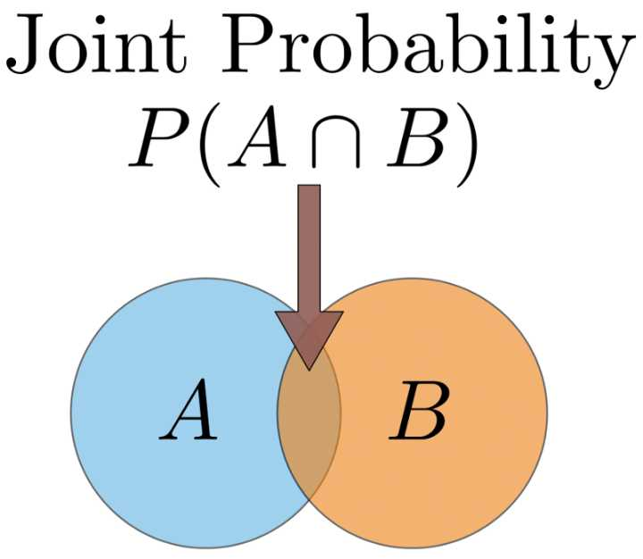
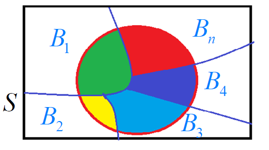
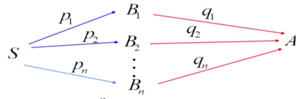
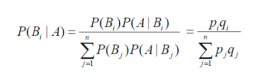
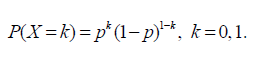
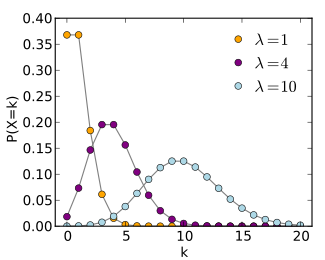
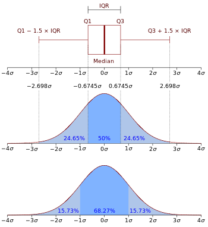
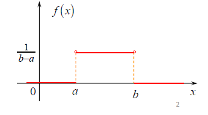
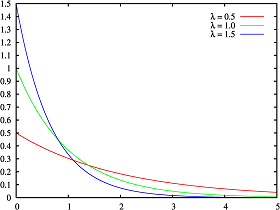
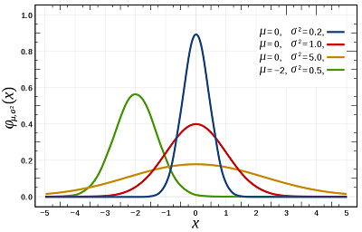

## 概率论

### 1 古典概型

抽扑克牌

若试验满足：

•样本空间S中样本点有限(**有限性**)

•出现每一个样本点的概率相等(**等可能性**)

称这种试验为等可能概型(或古典概型)
$$
P(A)=\frac{A所包含的样本点数}{S中的样本点数}
$$

### 2 联合概率

联合概率指的是包含多个条件且**所有条件同时成立**的概率，记作P(X=a,Y=b)或P(a,b)。

### 3 条件概率

事件*B*在事件*A*发生的条件下发生的概率：
$$
P(B|A)=\frac{P(AB)}{P(A)}, \quad P(A)\not= 0
$$

$$
P(AB) = P(A) \cdot P(B | A) = P(B) \cdot P(A| B)
$$

### 4 全概率公式

设 $B_1,B_2,...,B_n$ 为 样本空间S 的一个划分且 $P(B_i )> 0$ . 则有全概率公式：
$$
P(A)=\sum^n_{j=1}P(B_j) \cdot P(A|B_j)
$$

$$
P(A)=\sum^n_{j=1}p_jq_j
$$

### 5 贝叶斯公式

设 $B_1,B_2,...,B_n$ 为 S 的一个划分且 $P(B_i)> 0$ . 对 $P(A)>0$ 则有贝叶斯公式:

## 随机变量

### 随机变量（Random Variable）

随机变量是指变量的值无法预先确定仅以一定的可能性(概率)取值的量。它是随机获得的非确定值。

在经济活动中，随机变量是某一事件在相同的条件下可能发生也可能不发生的事件。例如某一时间内公共汽车站等车乘客人数，电话交换台在一定时间内收到的呼叫次数等等，都是随机变量的实例。

随机变量可以是离散型的，也可以是连续型的。

如果随机变量 ${\displaystyle X}$ 的取值是有限的或者是可数无穷尽的值，则称X 为离散型随机变量。

如果 ${\displaystyle X}$ 由全部实数或者由一部分区间组成，则称 ${\displaystyle X}$ 为连续随机变量。

, 

连续随机变量的取值是不可数及无穷尽的。

### 离散型随机变量及其概率分布

##### 0-1分布（伯努利分布）

若X的概率分布为

其中 $0<p<1$ , 就称X服从参数为 p 的 0-1 分布（或两点分布），记为 $X \sim B(1，p)$ . 1表示1次伯努利实验，p表示X取1的概率。

对于只有两个可能结果的试验, 称为伯努利(Bernoulli) 实验，故两点分布有时也称为伯努利分布.

应用：

检查产品的质量是否合格

对新生婴儿的性别进行登记

检验种子是否发芽

考试是否通过

求婚是否成功

马路乱停车是否会受罚

##### 二项分布 (Binomial)（n重伯努利实验）

若X的概率分布为
$$
P(X=k)=C_n^kP^k(1-p)^{n-k}, k=0,1,2,...n
$$
则称X 服从参数为n, p的二项分布, 记为 X~B（n，p），其中 $0<p<1$ .

当n=1时，为伯努利分布。

二项分布描述的是n重伯努利试验中“成功”出现次数 X 的概率分布.

##### 泊松分布（Poisson）

若X的概率分布为
$$
P(X=k)=\frac{\lambda^k}{k!}e^{-\lambda},\quad  k=0,1,2,...n, \quad \lambda>0
$$
则称X服从参数为 $\lambda$ 的泊松分布, 记作 $X \sim P(\lambda)$ .

参数 λ 是单位时间（或单位面积）内随机事件的平均发生率。

泊松分布适合描述单位时间内随机事件发生的次数：

横轴是索引*k*，发生次数。

应用：

来到某公共汽车站的乘客

某放射性物质发射出的粒子

显微镜下某区域中的白血球

### 连续型随机变量及其概率密度

连续型随机变量的概率密度函数（Probability density function）是一个描述这个随机变量的输出值，在某个确定的取值点附近的可能性的函数。

图中，横轴为随机变量的取值，纵轴为概率密度函数的值，而随机变量的取值落在某个区域内的概率为概率密度函数在这个区域上的积分。

设连续型随机变量X的分布函数为F(x),  若存在一个非负的函数 f(x), 对任何实数 x , 有
$$
F(x)=\int^x_{-\infty}f(t)dt
$$
则称 f(x) 为X的概率密度函数, 简称概率密度 .

#### 均匀分布（uniform distribution）

若随机变量X的概率密度为
$$
f(x)=\left\{{\begin{matrix}{\frac  {1}{b-a}}&\ \ \ {\mbox{ }}a\leq x\leq b\\0&{\mbox{其他}}\end{matrix}}\right.
$$
其中 $a<b$ ，就称 X服从（a，b）上的均匀分布，记为  ${\displaystyle X\sim U(a,b)}$ . 

性质：均匀分布具有等可能性,  X落入(a,b)中的等长度的任意子区间上是等可能的.

#### 指数分布 （Exponential distribution）

若X 的概率密度函数为

其中 $\lambda>0$ , 就称 X 服从参数为 $\lambda$ 的指数分布，记为  $X \sim E(\lambda)$ .

指数分布可以用来表示独立随机事件发生的时间间隔，比如旅客进入机场的时间间隔、打进客服中心电话的时间间隔。

#### 正态分布（normal distribution）

**正态分布**又名**高斯分布**（**Gaussian distribution**）

若X的概率密度函数为
$$
f(x)={1 \over \sigma\sqrt{2\pi} }\,e^{- {{(x-\mu )^2 \over 2\sigma^2}}}, \quad -\infty<x<+\infty
$$
其中 $-\infty <\mu<+\infty, \sigma>0$ , 就称X 服从参数为  $\mu, \sigma$ 的正态分布（高斯分布），记为

  ${\displaystyle X\sim N[\mu,\sigma^2]}$ .

应用：

测量误差

人的身高、体重

医学检验指标(红细胞数、血小板)

## 贝叶斯理论

贝叶斯理论源于贝叶斯提出的贝叶斯定理。贝叶斯定理引入了先验概率，后验概率由先验概率和条件概率表达式计算出。

假设有随机变量x和y，p(x,y) 表示它们的联合概率，p(x|y)和p(y|x)表示条件概率，其中p(y|x) 是后验概率，而p(y)称为 y的先验概率，x和 y的联合概率和条件概率满足下列关系：
$$
P(x,y) = P(y | x) \cdot P(x) = P(x|y) \cdot P(y)
$$

$$
交换后可得：\quad P(y | x) = \frac{ P(x|y) \cdot P(y)}{P(x)}
$$

上述公式即为贝叶斯定理，它提供了从先验概率p(y)计算后验概率p(y|x)的方法。

### 朴素贝叶斯算法（naive Bayes algorithm）

朴素贝叶斯算法是基于贝叶斯定理与**特征条件独立假设**的分类方法。对于给定的数据集，首先基于特征条件独立假设学习输入/输出的联合概率分布，然后基于此模型，对给定的输入x， 利用贝叶斯定理求出后验概率最大的输出y。

假设问题的特性向量为X，Xi={X1, X2, …,Xn}是特征属性之一，并且X1, X2,…,Xn之前相互独立，那么p(X|Y)可以分解为多个向量的积，即有
$$
P(X|Y) = \prod_{i=1}^nP(X_i | Y)
$$
引入贝叶斯定理可得：
$$
P(Y | X) = \frac{ P(Y) \cdot \prod_{i=1}^nP(X_i | Y)}{P(X)}
$$
其中p(X)是常数，先验概率p(Y)可以通过训练集中每类样本所占的比例进行估计。给定Y=y，如果要估计测试样本X的分类，由朴素贝叶斯分类得到y的后验概率为：
$$
P(Y=y | X) = \frac{ P(Y=y) \cdot \prod_{i=1}^nP(X_i | Y=y)}{P(X)}
$$
因此最后只要找到使 $ P(Y=y) \cdot \prod_{i=1}^nP(X_i | Y=y)$ 最大的类别y即可:

$$
argmax(P(Y=y) \cdot \prod_{i=1}^nP(X_i | Y=y))
$$

